# Introdução

Este manual tem como objetivo mostrar o uso das ferramentas do
InVesalius e também apresentar alguns conceitos para facilitar a
utilização do software.

O InVesalius é um software para auxiliar o profissional de saúde no
diagnóstico e no planejamento cirúrgico. Cabe ressaltar, porém, que todo
software no contexto de diagnóstico é totalmente suplementar, pois todo
e qualquer ato cometido é de inteira responsabilidade do profissional de
saúde.

Além da medicina, é possível utilizar o software em outras áreas, como
arqueologia, veterinária, ou mesmo em aplicações industriais. Como
requisito básico, basta que as imagens a serem analisadas estejam no
padrão DICOM (*Digital Imaging Communications in Medicine*). Até o
presente momento, o InVesalius reconstrói imagens provindas de
tomógrafos e de aparelhos de ressonância magnética. Para operar o
software, basta ter conhecimentos básicos de informática. Noções básicas
sobre imagens médicas podem contribuir para o melhor entendimento das
operações.

## Conceitos importantes

Nesta seção, discutiremos alguns conceitos necessários para melhor
entendimento e operação do software.

### DICOM (*Digital Image Communications in Medicine*)

DICOM é um padrão relativo à transmissão, ao armazenamento e ao
tratamento de imagens médicas. O padrão prevê diversas modalidades de
imagens médicas, como imagens provindas de equipamentos de tomografia
computadorizada, ressonância magnética, ultrassom, eletrocardiograma,
entre outras.

Uma imagem DICOM é composta por 2 itens principais, uma matriz contendo
os pixels da imagem e um conjunto de meta-informações. Essas informações
contêm, por exemplo, o nome do paciente, a modalidade da imagem e a
posição da imagem em relação ao espaço (no caso de tomografia e
ressonância).

### Tomografia Computadorizada - Médica

A tomografia computadorizada indica a radiodensidade dos tecidos, isto
é, a média de absorção de raios-X pelos tecidos. A radiodensiade é
traduzida para a imagem em níveis de cinza em uma escala chamada
*Hounsfield*, nome dado em homenagem a Godfrey Newbold Hounsfield, um
dos criadores da primeira máquina de tomografia computadorizada.

Nos aparelhos mais modernos, com um emissor de radiação e um banco de
sensores (também chamados de canais, variando de 2 até 256), que
circundam o paciente enquanto a maca é movimentada, formando uma
espiral, é possível gerar uma grande quantidade de imagens,
simultaneamente, com pouca emissão de raios-X.

#### Escala de Hounsfield

Como citado na seção anterior, as imagens de tomografia computadorizada
são geradas em níveis de cinza, os quais são depois traduzidos na escala
de Hounsfield (HU). Os tons mais claros representam tecidos mais densos,
e os mais escuros, tecidos menos densos, como a pele e o cérebro. A
tabela [2.1](#tab:escala_hounsfield){reference-type="ref"
reference="tab:escala_hounsfield"} apresenta alguns materiais e seus
respectivos valores em HU (*Hounsfield Unit*).

::: {#tab:escala_hounsfield}
  Material           HU        
  ----------- ---------------- --
  Ar           -1000 ou menos  
  Gordura           -120       
  Água               0         
  Músculo            40        
  Contraste         130        
  Osso          400 ou mais    

  : Escala de Hounsfield
:::

[]{#tab:escala_hounsfield label="tab:escala_hounsfield"}

### Tomografia Computadorizada - Odontológica

A tomografia computadorizada odontológica comumente trabalha com menos
emissão de radiação se comparada à tomografia computadorizada médica e,
em consequência, torna possível visualizar mais detalhes de regiões
delicadas, como a cortical alveolar.

A aquisição das imagens é feita com o paciente na vertical (ao contrário
da tomografia médica, em que o paciente fica na horizontal). Um emissor
e um sensor de raios-X circundam o crânio do paciente, formando um arco
de $180^\circ$ ou $360^\circ$. As imagens geradas pelo tomógrafo podem
ser interpretadas como um volume com o crânio do paciente imerso. Esse
volume é \"fatiado\" pelo software do aparelho, podendo-se gerar imagens
com espaçamentos diferentes ou outros tipos de imagens, como a visão
panorâmica da região de interesse.

As imagens adquiridas por tomógrafos odontológicos costumam exigir um
maior pós-processamento quando é necessário separar (segmentar)
determinadas estruturas usando outros softwares como o InVesalius. Isso
ocorre porque, normalmente, essas imagens possuem mais níveis de cinza
que a escala de Hounsfield, o que torna o uso de padrões de segmentação
*(presets)* menos eficiente. Outra característica bastante comum nas
imagens provindas de tomógrafos odontológicos é a alta presença de
ruídos do tipo *speckle* e a presença de outros ruídos normalmente
causados por uso de próteses de amálgama pelo paciente.

### Ressonância Magnética

A ressonância magnética é um exame realizado sem o uso de radiação
ionizante. Em vez disso, é utilizado um forte campo magnético para
alinhar os átomos de algum elemento presente em nosso corpo, comumente o
hidrogênio. Após o alinhamento, são disparadas ondas de rádio, e os
átomos são excitados. Os sensores medem o tempo que os átomos de
hidrogênio demoram para se alinhar novamente. Com isso, é possível
determinar qual é o tipo de tecido, pois tecidos diferentes apresentam
quantidades diferentes de átomos de hidrogênio.

Para evitar interferências e melhorar a qualidade do sinal de
radiofrequência, além de o paciente ficar dentro do equipamento, é
colocada uma bobina na região de interesse.

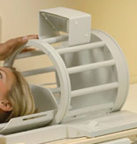

### Neuronavegação {#sec:neuronavegador_intro}

Neuronavegação é a uma técnica que permite localizar e rastrear
instrumentos cirúrgicos em relação às estruturas neuronais através da
visualização computacional. Além disso, sistemas de neuronavegação têm
sido apontados como uma ferramenta fundamental para estudos em
planejamento pré-cirúrgico e aumentar a precisão de experimentos em
neurociência, como a estimulação magnética transcraniana (EMT),
eletroencefalografia (EEG), magnetoencefalografia (MEG) e espectroscopia
no infravermelho próximo. Apesar do vasto campo de aplicações, o uso da
neuronavegação em centros de pesquisa é limitado pelo alto custo. O
módulo de neuronavegação do InVesalius oferece aos usuários uma
alternativa de baixo custo e código aberto aos sistemas comercias de
navegação. Desta maneira, é possível utilizar ferramentas específicas
para neuronavegação e ainda ter a possibilidade de desenvolvimento de
funcionalidades sob demanda. O neuronavegador é distribuído em uma
versão executável compatível com sistemas operacionais Windows 7, 8 e
10.. O capítulo [17](#sec:neuronavegador){reference-type="ref"
reference="sec:neuronavegador"}, apresenta detalhes sobre o uso desta
ferramenta.

## Recursos necessários

O InVesalius é projetado para executar em computadores pessoais, como
*desktops* e *notebooks*. Atualmente, ele é compatível com os seguintes
sistemas operacionais:\
- MS-Windows (Windows 7, 8 e 10)\
- GNU/Linux (Ubuntu, Mandriva, Fedora)\
- Apple Mac OS X

O desempenho do InVesalius depende, principalmente, da quantidade de
fatias reconstruídas (imagens abertas pelo software), da quantidade de
memória RAM disponível, da frequência do processador e da arquitetura do
sistema operacional (32 *bits* ou 64 *bits*).

Vale ressaltar, como regra geral, que quanto maior a quantidade de
memória RAM disponível no sistema, maior será o número de fatias que
podem ser abertas simultaneamente para um dado estudo. Por exemplo, com
1 GB de memória disponível, pode-se abrir cerca de 300 fatias com
resolução de 512x512 *pixels*. Já com 4 GB de memória, pode-se abrir em
torno de 1000 imagens com a mesma resolução.

### Configurações mínimas

-   Sistema operacional de 32-bit

-   Intel Pentium 4 ou equivalente 1.5 GHz

-   1 GB de RAM

-   10 GB de espaço disponível em disco

-   Placa gráfica com 64 MB de memória

-   Resolução de vídeo de 1024x768 pixels

### Configurações recomendadas

-   Sistema Operacional de 64-bit

-   Intel Core 2 Duo processor ou equivalente 2.5 GHz

-   8 GB de RAM

-   20 GB de espaço disponível em disco

-   Placa gráfica NVidia ou ATI, com 128 MB de memória

-   Resolução de vídeo de 1920x1080 pixels

# Instalação

## MS-Windows

Para instalar o InVesalius no MS-Windows, basta executar o programa
instalador. Quando aparecer uma janela pedindo para confirmar a execução
do arquivo, clique em **Sim**.

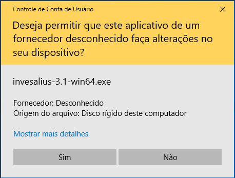

Uma nova janela pedirá para selecionar o idioma do instalador. Selecione
o idioma e clique em **OK**.

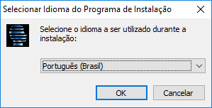

Em seguida, será exibida a janela do instalador. Clique em **Avançar**.

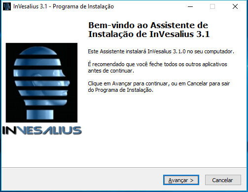

Selecione **Eu aceito os termos do Contrato** e clique em **Avançar**.

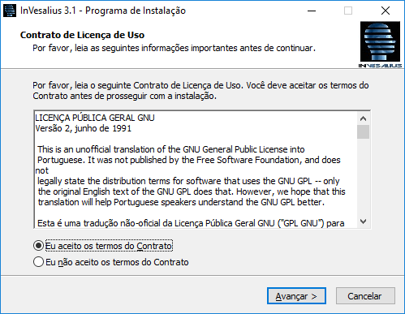

Clique em **Avançar** novamente.

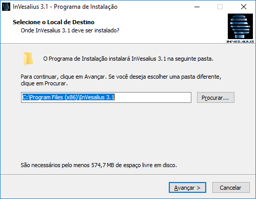

Clique em **Avançar**.

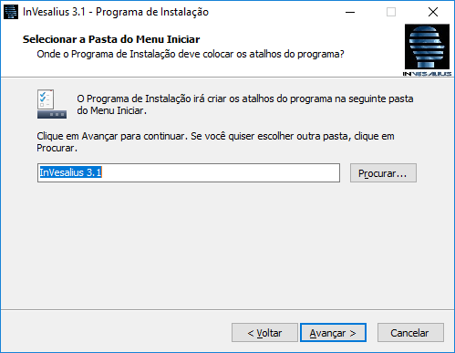

Selecione **Criar um ícone na Área de Trabalho** e clique em
**Avançar**.

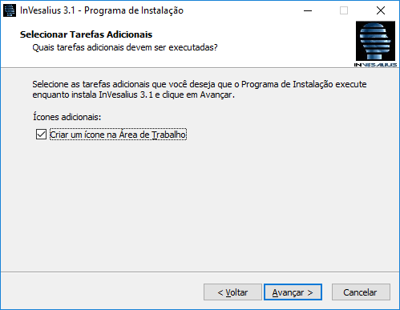

Clique em **Instalar**.

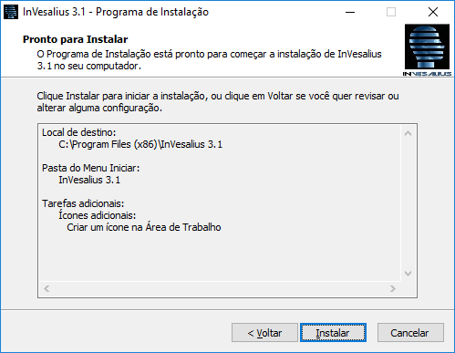

Enquanto o software é instalado, será exibida uma janela com o progresso
da instalação.

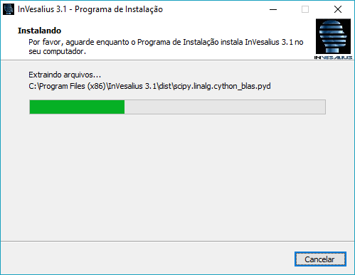

Para executar o InVesalius após a instalação, clique em **Concluir**.

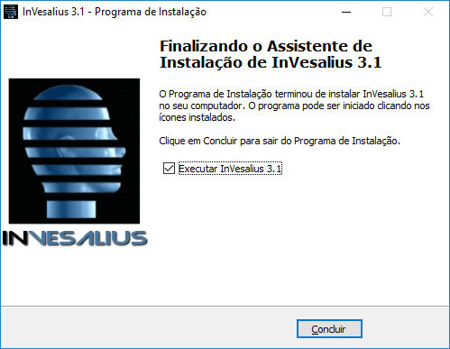

Caso seja a primeira vez em que o software é instalado, será exibida uma
janela para selecionar o idioma do InVesalius. Selecione o idioma
desejado e clique em **OK**.

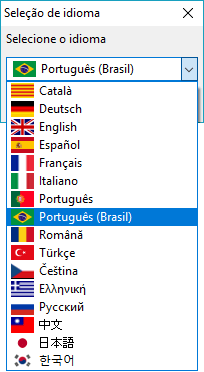

Enquanto o InVesalius é carregado, é exibida uma janela de abertura como
a da figura seguinte.

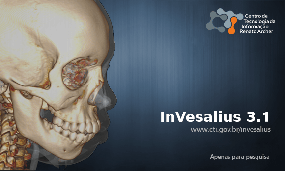

Em seguida, a janela principal do programa é aberta.

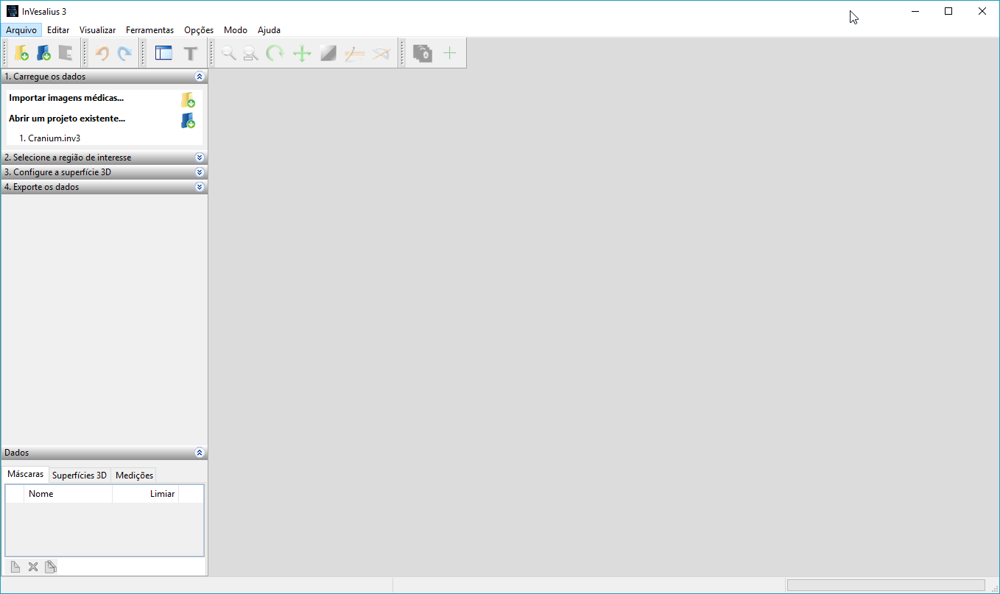

## Mac Os X

Para iniciar a instalação no Mac Os X, clique 2 vezes com o botão
esquerdo do mouse sobre o instalador. Em seguida o instalador será
inicializado.

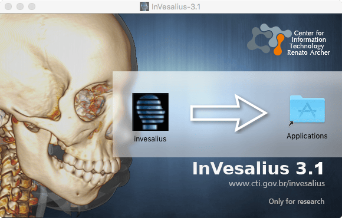

Mantenha o botão esquerdo pressionado sobre o ícone do software
InVesalius e arraste-o para o ícone *Applications* ambos contidos no
instalador.

O software já encontra-se instalado, bastando acessar pelo menu

# Importação

O InVesalius importa arquivos no formato DICOM, incluindo arquivos
compactados (JPEG sem perdas e com perdas) e arquivos no formato Analyze
(Mayo Clinic)©.

## DICOM

No menu **Arquivo**, clique na opção **Importar DICOM\...**. Se
preferir, use o atalho do teclado **Ctrl + I**. A importação também pode
ser acionada pelo ícone da barra de ferramentas descrito na figura
[4.1](#fig:import){reference-type="ref" reference="fig:import"}.

{#fig:import}

Em seguida, selecione o diretório que contenha os arquivos DICOM, como
na figura [4.2](#fig:win_folder){reference-type="ref"
reference="fig:win_folder"}. O InVesalius irá procurar por arquivos
também em subdiretórios do diretório escolhido, caso existam.

Clique em **OK**.

{#fig:win_folder}

Enquanto o InVesalius procura por arquivos DICOM no diretório, é exibido
o progresso do carregamento dos arquivos verificados, como ilustra a
figura [4.3](#fig:ver_file){reference-type="ref"
reference="fig:ver_file"}.

{#fig:ver_file}

Se arquivos DICOM forem encontrados, é aberta uma janela (figura
[4.4](#fig:win_import){reference-type="ref" reference="fig:win_import"})
para selecionar o paciente e a respectiva série que se deseja abrir.
Também é possível pular imagens para reconstrução.

{#fig:win_import}

Caso deseje importar uma série com todas as imagens presentes, clique em
\"**+**\" ao lado do nome do paciente para expandir as séries a ele
pertencentes. Dê um **clique duplo** com o botão **esquerdo** do mouse
sobre a descrição da série. Veja a figura
[4.5](#fig:import_serie){reference-type="ref"
reference="fig:import_serie"}.

{#fig:import_serie}

Em alguns casos, em particular quando não se dispõe de um computador com
memória e/ou processamento satisfatórios para trabalhar com muitas
imagens em uma série, pode ser recomendável pular (ignorar) algumas
delas. Para isso, clique **uma vez** com o botão **esquerdo** do mouse
sobre a descrição da série (figura
[4.5](#fig:import_serie){reference-type="ref"
reference="fig:import_serie"}) e selecione quantas imagens serão puladas
(figura [4.6](#fig:skip_image){reference-type="ref"
reference="fig:skip_image"}). Clique em **Importar**.

{#fig:skip_image}

Caso seja detectado quantidade insuficiente de memória disponível na
hora de carregar as imagens é recomentado reduzir a resolução das fatias
para trabalhar com visualização volumétrica e de superfície, como mostra
a janela [4.7](#fig:resize_image){reference-type="ref"
reference="fig:resize_image"}. As fatias serão redimensionadas de acordo
com a porcentagem em relação a resolução original. Por exemplo, se cada
fatia do exame contém a dimensão de 512 x 512 pixeis e for sugerido a
\"Porcentagem da resolução original\" em 60%, cada imagem resultante
terá 307 x 307 pixeis. Caso deseje abrir com a resolução original
selecione o valor 100.

{#fig:resize_image}

Se a imagem foi obtida com o gantry inclinado, será necessário fazer a
correção para evitar deformações na reconstrução. O InVesalius permite
fazer essa correção. Ao importar uma imagem com o gantry inclinado
aparecerá uma janela com o grau de inclinação do tilt
(figura [4.8](#fig:gantry_tilt){reference-type="ref"
reference="fig:gantry_tilt"}). É possível alterar esse valor, mas não é
recomendável. Clique no botão **OK** para fazer a correção. Se clicar em
**Cancelar** a reconstrução será realizada sem a correção.

{#fig:gantry_tilt}

Após os procedimentos anteriores, será apresentada uma janela (figura
[4.9](#fig:prog_recons){reference-type="ref"
reference="fig:prog_recons"}) com o progresso da reconstrução (quando as
imagens são empilhadas e interpoladas).

{#fig:prog_recons}

## Analyze

Para importar arquivos no formato Analyze, no menu **Arquivo**, clique
na opção **Importar outros arquivos\...** em seguida a opção **Analyze**
como mostra a figura [4.10](#fig:analyze_menu){reference-type="ref"
reference="fig:analyze_menu"}.

{#fig:analyze_menu}

Selecione o arquivo do tipo Analyze, na extensão **.hdr** e clique em
**Abrir**. (figura [4.11](#fig:analyze_import){reference-type="ref"
reference="fig:analyze_import"}).

{#fig:analyze_import}

## NIfTI

Para importar arquivos no formato NIfTI, no menu **Arquivo**, clique na
opção **Importar outros arquivos\...** em seguida a opção **NIfTI** como
mostra a figura [4.12](#fig:import_nifti_menu_pt){reference-type="ref"
reference="fig:import_nifti_menu_pt"}.

{#fig:import_nifti_menu_pt}

Selecione o arquivo do tipo NIfTI, na extensão **nii.gz** ou **.nii** e
clique em **Abrir**. (figura
[4.13](#fig:import_nifti_window_pt){reference-type="ref"
reference="fig:import_nifti_window_pt"}). Caso o arquivo esteja em outra
extensão como **.hdr**, selecione a opção **all files(\*.\*)**.

{#fig:import_nifti_window_pt}

## PAR/REC

Para importar arquivos no formato PAR/REC, no menu **Arquivo**, clique
na opção **Importar outros arquivos\...** em seguida a opção **PAR/REC**
como mostra a figura
[4.14](#fig:import_parrec_menu_pt){reference-type="ref"
reference="fig:import_parrec_menu_pt"}.

{#fig:import_parrec_menu_pt}

Selecione o arquivo do tipo PAR/REC, na extensão **.par** e clique em
**Abrir**. (figura
[4.15](#fig:import_parrec_window_pt){reference-type="ref"
reference="fig:import_parrec_window_pt"}). Caso o arquivo esteja sem
extensão, selecione a opção **all files(\*.\*)**.

{#fig:import_parrec_window_pt}

## TIFF, JPG, BMP, JPEG ou PNG (micro-CT)

Arquivos em formato TIFF, JPG, BMP, JPEG ou PNG para reconstrução podem
ser providos de equipamentos de microtomografia (micro-CT ou $\mu$CT) e
outros. O InVesalius importa arquivos nesses formatos desde que os
pixels presentes estejam em escala de cinza.

Para importar, clique no menu **Arquivo** e na opção **Importar outros
arquivos\...** em seguida clique na opção **TIFF, JPG, BMP, JPEG ou PNG
($\mu$CT)** como mostra a
figura [4.16](#fig:import_bmp_menu_pt){reference-type="ref"
reference="fig:import_bmp_menu_pt"}.

{#fig:import_bmp_menu_pt}

Selecione o diretório que contenha os arquivos, como mostra a figura
[4.17](#fig:import_bmp_select_folder){reference-type="ref"
reference="fig:import_bmp_select_folder"}. O InVesalius irá procurar por
arquivos também em subdiretórios do diretório escolhido, caso existam.

Clique em **OK**.

{#fig:import_bmp_select_folder}

Enquanto o InVesalius procura por arquivos TIFF, JPG, BMP, JPEG ou PNG
no diretório, é exibido o progresso do carregamento dos arquivos
verificados, como ilustra a figura
[4.18](#fig:import_bmp_load_pt){reference-type="ref"
reference="fig:import_bmp_load_pt"}.

{#fig:import_bmp_load_pt}

Se arquivos do tipo TIFF, JPG, BMP, JPEG ou PNG forem encontrados, é
aberta uma janela
(figura [4.19](#fig:import_bmp_window_pt){reference-type="ref"
reference="fig:import_bmp_window_pt"}) para exibir os arquivos
encontrados elegíveis para reconstrução. Também é possível pular imagens
para reconstrução ou remover arquivos da lista para reconstrução. Os
arquivos são ordenados de acordo com o nome do arquivo, recomenda-se
utilizar números em seus nomes de acordo com a ordem que deseja-se obter
na reconstrução.

{#fig:import_bmp_window_pt}

Para excluir os arquivos que não são de interesse, é possível selecionar
um arquivo clicando com o **botão esquerdo do mouse** e em seguida
pressionar a tecla **delete**. É possível também escolher uma faixa de
arquivos para deletar, para isso é necessário clicar com o **botão
esquerdo do mouse** no primeiro arquivo da faixa, manter pressionada a
tecla **shift**, clicar novamente com o **botão esquerdo do mouse** no
último arquivo da faixa e finalmente pressionar o botão **delete**.

A exemplo da importação de arquivos DICOM, é possível pular imagens BMP
para reconstrução. Em alguns casos, em particular quando não se dispõe
de um computador com memória e/ou processamento satisfatórios para
trabalhar com muitas imagens em uma série, pode ser recomendável pular
(ignorar) algumas delas. Para isso, selecione quantas imagens serão
puladas (figura [4.20](#fig:import_bmp_skip_pt){reference-type="ref"
reference="fig:import_bmp_skip_pt"}). Clique em **Importar**.

{#fig:import_bmp_skip_pt}

Para a reconstrução desse tipo de arquivo é necessário definir um nome
para o projeto, indicar qual a orientação das imagens (axial, coronal ou
sagital), espaçamento do voxel ($X$, $Y$ e $Z$) em **milímetros** como
mostra a figura [4.21](#fig:import_bmp_spacing_pt){reference-type="ref"
reference="fig:import_bmp_spacing_pt"}. O espaçamento do voxel em $X$ é
largura do pixel de cada imagem, $Y$ o comprimento do pixel e $Z$
representa a distância de cada fatia (altura do voxel).

Caso o conjunto de imagens seja de imagens de microtomografia, mais
especificamente de equipamentos das marcas GE e Brucker, é possível que
o InVesalius realize a leitura do arquivo texto com os parâmetros de
aquisição que normalmente fica na mesma pasta das imagens e insira
automaticamente o espaçamento. Essa constatação pode ser feita quando os
valores de $X$, $Y$ e $Z$ são diferentes de \"1.00000000\", caso
contrário é necessário digitar os valores dos respectivos espaçamento.

**Atenção, o espaçamento é um parâmetro primordial para a correta
dimensão dos objetos no software. Espaçamento incorreto irá fornecer
medidas incorretas.**

Uma vez preenchido todos os parâmetros, basta clicar no botão **Ok**.

{#fig:import_bmp_spacing_pt}

Caso seja detectado quantidade insuficiente de memória disponível na
hora de carregar as imagens é recomentado reduzir a resolução das fatias
para trabalhar com visualização volumétrica e de superfície, como mostra
a janela [4.22](#fig:import_bmp_resize_pt){reference-type="ref"
reference="fig:import_bmp_resize_pt"}. As fatias serão redimensionadas
de acordo com a porcentagem em relação a resolução original. Por
exemplo, se cada fatia do exame contém a dimensão de 512 x 512 pixeis e
for sugerido a \"Porcentagem da resolução original\" em 60%, cada imagem
resultante terá 307 x 307 pixeis. Caso deseje abrir com a resolução
original selecione o valor 100.

{#fig:import_bmp_resize_pt}

Após os passos anteriores é necessário aguardar um instante para
completar a reconstrução multiplanar conforme mostra a
figura [4.23](#fig:import_bmp_mpr_pt.png){reference-type="ref"
reference="fig:import_bmp_mpr_pt.png"}.

{#fig:import_bmp_mpr_pt.png}

# Ajuste de imagem

O InVesalius não garante a correta ordem das imagens pois depende de
informações que estão presentes nas imagens, algumas vezes essas imagens
tem as informações incorretas ou não seguem o padrão DICOM. Dessa forma
é recomendável confirmar se a lesão ou algum outro marco anatômico
presente em um determinado paciente é exibido no lado correto da imagem.
Caso não seja, é possível utilizar as ferramentas de espelhar a imagem
ou inverter eixos. Também para o alinhamento da imagem, existe a
ferramenta de rotação da imagem.

## Espelhar

É possível espelhar um dos lados da imagem de modo que eles se invertam,
para isso é necessário ir no menu, **Ferramentas**, **Imagem**,
**Espelhar** e clicar em uma das seguintes opções
(figura [5.1](#fig:menu_img_mirroring_axis_pt){reference-type="ref"
reference="fig:menu_img_mirroring_axis_pt"}):

-   Direita - Esquerda

-   Anterior - Posterior

-   Superior - Inferior

{#fig:menu_img_mirroring_axis_pt}

A figura [5.2](#fig:mirrored){reference-type="ref"
reference="fig:mirrored"} apresenta um comparativo entre a imagem não
espelhada e a imagem espelhada. Por o conjunto de imagens formar um
volume, ao aplicar espelhamento todas as outras orientações são
modificadas também.

<figure id="fig:mirrored">

<figcaption>Exemplo de imagem com direita-esquerda
espelhada.</figcaption>
</figure>

## Trocar Eixo

A ferramenta de troca de eixo, muda as orientações da imagem caso ela
tem sido importada erroneamente. Para isso é necessário ir no menu,
**Ferramentas**, **Imagem**, **Trocar Eixo** e clicar em uma das
seguintes opções
(figura [5.3](#fig:menu_invert_axis){reference-type="ref"
reference="fig:menu_invert_axis"}):

-   Da Direita para Anterior-Posterior

-   Da Direita-Esquerda para Superior-Inferior

-   Da Anterior-Posterior para Superior-Inferior

As figuras [5.4](#fig:invert_axis_axial){reference-type="ref"
reference="fig:invert_axis_axial"}
e [5.5](#fig:invert_axis_axial_inverted){reference-type="ref"
reference="fig:invert_axis_axial_inverted"}, apresentam um exemplo de
imagens com eixo invertido.

{#fig:menu_invert_axis}

{#fig:invert_axis_axial}

{#fig:invert_axis_axial_inverted}

## Reorientar imagem (Rotacionar)

Caso seja necessário alinhar a imagem levando em consideração algum
ponto de referencia como algum marco anatômico, é possível realizar essa
tarefa utilizando a ferramenta de reorientação de imagem. Para abrir a
ferramenta é necessário ir ao menu, **Ferramentas**, **Imagem** e por
último **Reorientar imagem**
(figura [5.6](#fig:menu_img_reorient){reference-type="ref"
reference="fig:menu_img_reorient"}).

{#fig:menu_img_reorient}

Ao abrir a ferramenta será exibida uma janela
(figura [5.7](#fig:image_reorient_window){reference-type="ref"
reference="fig:image_reorient_window"}) que mostra em qual orientação e
quantos graus a imagem foi rotacionada.

{#fig:image_reorient_window}

Inicialmente é necessário definir qual o método de interpolação que será
aplicado ao rotacionar a imagem, por padrão o método é o tricúbico. As
outras opções de interpolação são:

-   Vizinho mais próximo

-   Trilinear

-   Tricúbica

-   Lanczos

Após selecionado o método de interpolação, é necessário definir em
função de qual ponto a imagem será rotacionada, para isso é necessário
**manter o botão esquerdo do mouse pressionado** entre a interseção de
duas linhas
(figura [5.8](#fig:image_reorient_adjust_center){reference-type="ref"
reference="fig:image_reorient_adjust_center"}) em uma das janelas de
orientação axial, coronal ou sagital e arrastar até o ponto desejado.

{#fig:image_reorient_adjust_center}

Para rotacionar a imagem é necessário **manter o botão esquerdo do mouse
pressionado** e **arrastar** de forma que o ponto de referencia ou marco
anatômico fique alinhado com uma das linhas
(figura [5.9](#fig:image_reorient_rotated){reference-type="ref"
reference="fig:image_reorient_rotated"}). Após a imagem estar na posição
desejada, é necessário clicar no botão **Aplicar**, presente na janela
de parâmetros
(figura [5.7](#fig:image_reorient_window){reference-type="ref"
reference="fig:image_reorient_window"}), dependo do tamanho da imagem é
necessário aguardar alguns segundos até o processo finalizar. A
figura [5.10](#fig:image_reorient_rotated_applied){reference-type="ref"
reference="fig:image_reorient_rotated_applied"} apresenta uma imagem com
o processo de de reorientação finalizada.

{#fig:image_reorient_rotated}

{#fig:image_reorient_rotated_applied}

# Manipulação de Imagens (2D)

## Reconstrução Multiplanar

Ao importar as imagens, o InVesalius mostra, automaticamente, a sua
reconstrução multiplanar nas orientações Axial, Sagital e Coronal, bem
como uma janela para manipulação 3D. Veja a figura
[6.1](#fig:mpr){reference-type="ref" reference="fig:mpr"}.

{#fig:mpr}

Além de criar a reconstrução multiplanar, o InVesalius segmenta a
imagem, destacando, por exemplo, os ossos dos tecidos moles. O destaque
é representado por meio da aplicação de cores sobre a estrutura
segmentada, isto é, as cores formam uma máscara sobre a imagem
destacando a estrutura (figura [6.1](#fig:mpr){reference-type="ref"
reference="fig:mpr"}). Isso será discutido em mais detalhes nos próximos
capítulos.

Para esconder a máscara, usa-se o gerenciador de dados, localizado no
canto inferior esquerdo da tela. Basta escolher a aba **Máscaras** e
clicar **uma** vez com o botão **esquerdo** do mouse sobre o ícone do
olho ao lado de **\"Máscara 1\"**. Veja a figura
[6.2](#fig:ger_masc){reference-type="ref" reference="fig:ger_masc"}.

{#fig:ger_masc}

O ícone do olho desaparece, e as cores da máscara de segmentação são
escondidas (figura [6.3](#fig:mpr_sem_mask){reference-type="ref"
reference="fig:mpr_sem_mask"}).

{#fig:mpr_sem_mask}

### Orientação axial

A orientação axial é composta de cortes transversais da região de
interesse, ou seja, cortes paralelos ao plano axial do corpo humano. Na
figura [6.4](#fig:axial_corte){reference-type="ref"
reference="fig:axial_corte"}, é exibida uma imagem em orientação axial
da região do crânio.

{#fig:axial_corte}

### Orientação sagital

A orientação sagital é composta de cortes realizados lateralmente em
relação à região de interesse, ou seja, cortes paralelos ao plano
sagital do corpo humano, que o divide nas porções esquerda e direita. A
figura [6.5](#fig:sagital_slice){reference-type="ref"
reference="fig:sagital_slice"} mostra uma imagem do crânio em orientação
sagital.

{#fig:sagital_slice}

### Orientação coronal

A orientação coronal é composta de cortes paralelos ao plano coronal,
que divide o corpo humano em metades ventral e dorsal. A figura
[6.6](#fig:coronal_slice){reference-type="ref"
reference="fig:coronal_slice"} mostra uma imagem do crânio em orientação
coronal.

{#fig:coronal_slice}

## Correspondência entre as orientações axial, sagital e coronal {#sec:corresp_all_orient}

Para saber qual o ponto comum das imagens nas diferentes orientações,
basta acionar o recurso \"Cruz de interseção de fatias\" pelo ícone de
atalho localizado na barra de ferramentas. Veja a figura
[6.7](#fig:cross_icon){reference-type="ref" reference="fig:cross_icon"}.

{#fig:cross_icon}

Quando o recurso é acionado, dois segmentos de reta que se cruzam
perpendicularmente são exibidos sobre cada imagem (figura
[6.8](#fig:cross_all){reference-type="ref" reference="fig:cross_all"}).
O ponto de interseção de cada par de segmentos representa o ponto comum
entre as diferentes orientações.

Para modificar o ponto, mantenha **pressionado** o botão **esquerdo** do
mouse e o **arraste**. Automaticamente, os pontos correspondentes serão
atualizados em cada imagem.

{#fig:cross_all}

Para desativar a funcionalidade, basta clicar novamente sobre o atalho
(figura [6.7](#fig:cross_icon){reference-type="ref"
reference="fig:cross_icon"}). Esse recurso pode ser utilizado em
conjunto com o editor de fatias (que será comentado mais à frente).

## Interpolação

Por padrão a visualização das imagens 2D são interpoladas
(figura [6.10](#fig:interp){reference-type="ref"
reference="fig:interp"}).a, caso deseja desativar esse recurso, basta ir
no menu **Visualizar**, **Fatias interpoladas**
(figura [6.9](#fig:menu_interpoleted_image_pt){reference-type="ref"
reference="fig:menu_interpoleted_image_pt"}). Dessa forma será possível
visualizar cada pixel individualmente como mostra a
figura [6.10](#fig:interp){reference-type="ref"
reference="fig:interp"}.b.

**Observação: Essa interpolação é apenas para efeitos de visualização,
não influenciando diretamente na segmentação ou na geração de superfície
3D.**

{#fig:menu_interpoleted_image_pt}

<figure id="fig:interp">

<figcaption>Visualização de imagem interpolada e não
interpolada.</figcaption>
</figure>

## Mover

Para mover uma imagem na tela, pode-se utilizar o ícone do atalho
\"Mover\" da barra de ferramentas (figura
[6.11](#fig:move_icon){reference-type="ref" reference="fig:move_icon"}).
Clique sobre o ícone para ativar o recurso e, em seguida, com o botão
**esquerdo** do mouse pressionado sobre a imagem, **arraste-a** para a
direção desejada. A figura [6.12](#fig:move_img){reference-type="ref"
reference="fig:move_img"} mostra uma imagem deslocada (movida).

{#fig:move_icon}

{#fig:move_img}

## Rotacionar

A rotação de imagens pode ser ativada pelo ícone do atalho
\"Rotacionar\" da barra de ferramentas (figura
[6.13](#fig:rot_icon){reference-type="ref" reference="fig:rot_icon"}).
Para rotacionar uma imagem, clique sobre o ícone e, em seguida, com o
botão **esquerdo** do mouse pressionado sobre a imagem, **arraste-a** no
sentido horário ou anti-horário, dependendo do sentido de rotação
desejado.

{#fig:rot_icon}

{#fig:rotate_all}

## Ampliar (*Zoom*)

No InVesalius, existem diferentes formas de ampliar uma imagem. Pode-se
maximizar a janela da orientação desejada, aplicar o *zoom* diretamente
na imagem, ou selecionar a região da imagem que será ampliada.

### Maximizando as janelas de orientação

Como já sabemos, a janela principal do InVesalius é dividida em 4
subjanelas: axial, sagital, coronal e 3D. Cada uma delas pode ser
maximizada de modo a ocupar toda a área da janela principal. Para isso,
basta clicar com o botão **esquerdo** do mouse no ícone existente no
**canto superior direito** da subjanela (figura
[6.15](#fig:maximize_window){reference-type="ref"
reference="fig:maximize_window"}). Para restaurar uma janela maximizada
a seu tamanho anterior, basta clicar novamente no ícone.

{#fig:maximize_window}

### Ampliando ou reduzindo uma imagem

Para ampliar ou reduzir uma imagem, clique sobre o ícone do atalho
\"*Zoom*\" na barra de ferramentas (figura
[6.16](#fig:zoom_icon){reference-type="ref" reference="fig:zoom_icon"}).
Mantenha o botão **esquerdo** pressionado sobre a imagem e **arraste** o
mouse para **cima**, caso deseje ampliá-la, ou para **baixo**, caso
deseje reduzi-la.

{#fig:zoom_icon}

### Ampliando uma área da imagem

Para ampliar uma área determinada da imagem, clique sobre o ícone do
atalho \"Zoom baseado na seleção\" na barra de ferramentas (figura
[6.17](#fig:zoom_icon_loc){reference-type="ref"
reference="fig:zoom_icon_loc"}). Posicione o ponteiro do mouse na
posição inicial da seleção, clique e mantenha o botão **esquerdo** do
mouse pressionado e **arraste-o** até a posição final da seleção,
formando um retângulo (figura
[6.18](#fig:zoom_select){reference-type="ref"
reference="fig:zoom_select"}). Assim que o botão esquerdo do mouse for
liberado, a operação de *zoom* será aplicada à região selecionada
(figura [6.19](#fig:zoom_applied){reference-type="ref"
reference="fig:zoom_applied"}).

{#fig:zoom_icon_loc}

{#fig:zoom_select}

{#fig:zoom_applied}

## Brilho e contraste (Janelas) {#sec:ww_wl}

Para melhorar a visualização das imagens, podemos utilizar o recurso de
*window width* e *window level*, popularmente conhecido por \"brilho e
contraste\" ou \"janela\" (para radiologistas). Com esse recurso, é
possível definir a faixa da escala de cinza (*window level*) e a largura
dessa faixa (*window width*) que serão usadas para exibir as imagens.

O recurso pode ser acionado pelo ícone do atalho \"Contraste\" na barra
de ferramentas. Veja a figura
[6.20](#fig:window_level_shortcut){reference-type="ref"
reference="fig:window_level_shortcut"}.

{#fig:window_level_shortcut}

Para aumentar o brilho, mantenha o botão **esquerdo** do mouse
pressionado e o **arraste** na horizontal para a direita. Para diminuir
o brilho, basta arrastar o mouse para a esquerda. O contraste pode ser
alterado arrastando o mouse (com o botão **esquerdo** pressionado) na
vertical: para cima para aumentar, ou para baixo para diminuir o
contraste.

Para desabilitar o recurso, clique novamente sobre o ícone do atalho
(figura [6.20](#fig:window_level_shortcut){reference-type="ref"
reference="fig:window_level_shortcut"}).

É possível utilizar padrões pré-definidos de brilho e contraste. A
tabela [6.1](#tab:window_level){reference-type="ref"
reference="tab:window_level"} relaciona alguns tipos de tecido com os
respectivos valores de brilho e contraste da imagem. Para usar um padrão
pré-definido, posicione o cursor do mouse sobre a imagem e clique com o
botão **direito** para abrir um menu de contexto sobre ela. Quando o
menu se abrir, selecione a entrada **Brilho e Contraste** e, em seguida,
clique sobre a opção pré-definida, de acordo com o tipo de tecido, como
mostra a figura [6.21](#fig:window_level){reference-type="ref"
reference="fig:window_level"}.

{#fig:window_level}

::: {#tab:window_level}
  Tecido                                 Brilho    Contraste
  ------------------------------------ ---------- -----------
  Padrão                                 Exame       Exame
  Manual                                Alterado   Alterado
  Abdômen                                 350         50
  Cérebro                                  80         40
  Enfisema                                500        -850
  Fossa Posterior Nasal                   120         40
  Fígado                                  2000       -500
  Isquemia - Contraste Tecidos Duros       15         32
  Isquemia - Contraste Tecidos Moles       80         20
  Laringe                                 180         80
  Mediastino                              350         25
  Osso                                    2000        300
  Pélvis                                  450         50
  Pulmão Duro                             1000       -600
  Pulmão Mole                             1600       -600
  Seio                                    4000        400
  Vascular - Duro                         240         80
  Vascular - Mole                         680         160

  : Valores de brilho e contraste para alguns tecidos
:::

[]{#tab:window_level label="tab:window_level"}

<figure id="fig:two_window_level">

<figcaption>Diferentes tipos de brilho e constraste</figcaption>
</figure>

## Pseudocor

Outro recurso para melhorar a visualização das imagens são as
pseudocores. Elas substituem os níveis de cinza por cores, ou pelos
níveis de cinza invertidos. Nesse último caso, regiões da imagem que
antes eram mais claras se tornam mais escuras e vice-versa.

Para alterar a visualização usando uma pseudocor, posicione o cursor do
mouse sobre a imagem e clique com o botão **direito** para abrir um menu
de contexto sobre ela. Quando o menu se abrir, selecione a entrada
**Pseudocor** e, em seguida, clique sobre a opção de pseudocor desejada,
como mostra a figura [6.23](#fig:pseudo_color){reference-type="ref"
reference="fig:pseudo_color"}.

{#fig:pseudo_color}

As figuras de
[\[fig:image_default\]](#fig:image_default){reference-type="ref"
reference="fig:image_default"} a
[\[fig:image_saturation\]](#fig:image_saturation){reference-type="ref"
reference="fig:image_saturation"} exemplificam as diversas opções de
pseudocor disponíveis.

<figure id="fig:pseudo_color_types">

 
 

<figcaption>Alguns tipos diferentes de pseudo-cor</figcaption>
</figure>

## Tipo de projeção

É possível alterar o tipo de projeção das imagens 2D a serem
visualizadas, além do modo normal, o InVesalius dispõe de seis tipos de
projeções que podem serem acessadas da seguinte forma: Possicione o
cursor do mouse sobre a imagem e clique com o botão **direito** para
abrir um menu de contexto sobre ela. Quando o menu se abrir, selecione a
entrada tipo de projeção e, em seguida, clique sobre a opção de
pseudocor desejada, como mostra a
figura [6.25](#fig:menu_proj){reference-type="ref"
reference="fig:menu_proj"}.

{#fig:menu_proj}

### Normal

O modo normal é a visualização padrão, ou seja, sem nenhum tipo de
projeção, da maneira em que a imagem foi adquirida ou customizada
previamente seja com brilho e contraste ou pseudocor. Exemplificamos na
figura [6.26](#fig:proj_normal){reference-type="ref"
reference="fig:proj_normal"}.

{#fig:proj_normal}

### MaxIP {#sec:max_ip}

MaxIP também é conhecido como MIP (*Maximum Intensity Projection*), o
método seleciona somente os voxels que possuem intensidade máxima entre
os visitados como mostra a
figura [6.27](#fig:proj_maxip){reference-type="ref"
reference="fig:proj_maxip"}. De acordo com a quantidade ou
\"profundidade\" do MaxIP cada voxel é visitado em ordem de
sobreposição, por exemplo, para selecionar MaxIP do pixel $(0,0)$
composto por 3 fatias é necessário visitar o pixel $(0,0)$ das fatias
$(1,2,3)$ e selecionar o maior valor.

{#fig:proj_maxip}

Como mostra a figura [6.28](#fig:proj_maxip_qtd){reference-type="ref"
reference="fig:proj_maxip_qtd"}, a quantidade de imagens que irá compor
o MaxIP é setada no inferior da imagem de cada orientação.

{#fig:proj_maxip_qtd}

### MinIP

Ao contrário do MaxIP, o MinIP (*Minimum Intensity Projection*)
seleciona somente os voxels que possuem internsidade minima entre os
visitados, apresentamos na
figura [6.29](#fig:proj_minIP){reference-type="ref"
reference="fig:proj_minIP"} um exemplo. A seleção da quantidade de
imagens que irá compor a projeção é feita no inferior da imagem de cada
orientação como mostra a
figura [6.28](#fig:proj_maxip_qtd){reference-type="ref"
reference="fig:proj_maxip_qtd"}.

{#fig:proj_minIP}

### MeanIP

A técnica MeanIP (*Mean Intensity Projection*) que é mostrada na
figura [6.30](#fig:proj_meanIP){reference-type="ref"
reference="fig:proj_meanIP"} compõe a projeção realizando a média dos
voxels visitados. Os voxels são visitados da mesma forma dos métodos
MaxIP e MinIP. Também é possível definir quantas imagens irão compor a
projeção no inferior da imagem de cada orientação como é mostrada na
figura [6.28](#fig:proj_maxip_qtd){reference-type="ref"
reference="fig:proj_maxip_qtd"}.

{#fig:proj_meanIP}

### MIDA {#sub:mida}

A técnica MIDA (*Maximum Intensity Difference Accumulation*) projeta uma
imagem levando em consideração somente os voxels que possuem valores
máximos locais. A partir de cada pixel da tela é simulado um raio em
direção ao volume, cada voxel é interceptado por cada um destes raios
chegando até o final do volume, cada um desses voxels visitados tem o
seu valor acumulado, mas são levados em consideração somente se o valor
for maior que os valores já visitados anteriormente. A exemplo do MaxIP,
é possível selecionar quantas imagens serão utilizadas para acumular os
valores. Apresentamos na
figura [6.31](#fig:proj_MIDA){reference-type="ref"
reference="fig:proj_MIDA"} um exemplo de projeção MIDA.

{#fig:proj_MIDA}

Como mostra a figura [6.32](#fig:proj_MIDA_inv){reference-type="ref"
reference="fig:proj_MIDA_inv"}, é possível inverter a ordem que os
voxels são visitados, bastando selecionar a opção **Ordem invertida** no
canto inferior da tela.

{#fig:proj_MIDA_inv}

### Contorno MaxIP

Compõe a projeção 2D do conjunto de imagens que contém o volume usando a
técnica *Contour MaxIP*. A técnica consiste em visualizar contornos
presentes na projeção gerada com a técnica
MaxIP([6.9.2](#sec:max_ip){reference-type="ref"
reference="sec:max_ip"}). Um exemplo é apresentado na
figura [6.33](#fig:proj_contorno_maxip){reference-type="ref"
reference="fig:proj_contorno_maxip"}.

{#fig:proj_contorno_maxip}

### Contorno MIDA

Compõe a projeção 2D do conjunto de imagens que contém o volume usando a
técnica *Contour MIDA*. A técnica consiste em visualizar contornos
presentes na projeção gerada com a técnica
MIDA([6.9.5](#sub:mida){reference-type="ref" reference="sub:mida"}). A
exemplo do MIDA é possível inverter a ordem que o volume é visitado.
Exemplificamos na
figura [6.34](#fig:proj_contorno_mida){reference-type="ref"
reference="fig:proj_contorno_mida"}.

{#fig:proj_contorno_mida}

# Segmentação

Para selecionar um determinado tipo de tecido da imagem, é utilizado o
recurso de segmentação, disponível no InVesalius.

## Limiar (*Threshold*)

Limiar é uma técnica de segmentação de imagens que permite selecionar da
imagem somente os *pixels* cuja intensidade está dentro de um limiar
definido pelo usuário. O limiar é definido por dois números, limiares
inicial e final, também conhecidos como *thresholds* mínimo e máximo.
Como referência para a definição, é utilizada a escala de Hounsfield
(tabela [2.1](#tab:escala_hounsfield){reference-type="ref"
reference="tab:escala_hounsfield"}).

A segmentação é acionada no painel situado no lado esquerdo da interface
do InVesalius, no item **2. Selecione a região de interesse** (figura
[7.1](#fig:region_selection){reference-type="ref"
reference="fig:region_selection"}).

{#fig:region_selection}

Antes de iniciar a segmentação, é necessário configurar uma máscara. A
máscara é uma imagem com a região selecionada colorida e sobreposta à
imagem original. Veja a figura
([7.2](#fig:region_selection_masc){reference-type="ref"
reference="fig:region_selection_masc"})

{#fig:region_selection_masc}

Para alterar o limiar, pode-se utilizar a barra que representa os níveis
de cinza na imagem (figura
[7.3](#fig:region_selection_bar){reference-type="ref"
reference="fig:region_selection_bar"}). É possível alterar o limiar
inicial usando o controle deslizante *esquerdo* da barra. De forma
semelhante, o limiar final pode ser alterado por meio do controle
*direito*. É possível, ainda, digitar diretamente os valores desejados
nas respectivas caixas de texto nas extremidades da barra. Com a
alteração dos valores, automaticamente a máscara será atualizada,
pintando somente os *pixels* com intensidade dentro da faixa
determinada.

{#fig:region_selection_bar}

Também existem valores pré-definidos de limiar de acordo com alguns
tipos de tecido, como mostra a figura
[7.4](#fig:limiar_presets){reference-type="ref"
reference="fig:limiar_presets"}. Basta selecionar o tecido desejado e a
máscara será atualizada automaticamente.

{#fig:limiar_presets}

A tabela [7.1](#tab:limiar){reference-type="ref" reference="tab:limiar"}
mostra a faixa de níveis de cinza de acordo com o tipo de tecido ou
material.

::: {#tab:limiar}
  Material                      Limiar inicial   Limiar final
  ---------------------------- ---------------- --------------
  Esmalte (Adulto)                   1553            2850
  Esmalte (Criança)                  2042            3021
  Osso                               226             3021
  Osso Compacto (Adulto)             662             1988
  Osso Compacto (Criança)            586             2198
  Osso Esponjoso (Adulto)            148             661
  Osso Esponjoso (Criança)           156             585
  Personalizado                  Def. Usuário    Def. Usuário
  Tecido Epitelial (Adulto)          -718            -177
  Tecido Epitelial (Criança)         -766            -202
  Tecido Gorduroso (Adulto)          -205            -51
  Tecido Gorduroso (Criança)         -212            -72
  Tecido Muscular (Adulto)            -5             135
  Tecido Muscular (Criança)          -25             139
  Tecidos Moles                      -700            225

  : Limiares pré-definidos para alguns materiais
:::

[]{#tab:limiar label="tab:limiar"}

A tabela [7.1](#tab:limiar){reference-type="ref" reference="tab:limiar"}
é mais indicada para tomógrafos médicos. Nos tomógrafos odontológicos,
comumente as faixas de níveis de cinza são maiores e não regulares.
Assim, é necessário utilizar a barra de limiar (figura
[7.3](#fig:region_selection_bar){reference-type="ref"
reference="fig:region_selection_bar"}) para ajustá-las.

Caso se deseje criar uma nova máscara, basta clicar no ícone do atalho
presente no painel, dentro do item **2. Selecione a região de
interesse**. Veja a figura
[7.5](#fig:shortcut_new_mask){reference-type="ref"
reference="fig:shortcut_new_mask"}.

{#fig:shortcut_new_mask}

Clicando-se nesse atalho, uma nova janela será apresentada (figura
[7.6](#fig:create_new_mask){reference-type="ref"
reference="fig:create_new_mask"}). Selecione a faixa de limiar desejada
e clique em **OK**.

{#fig:create_new_mask}

Com uma máscara de segmentação configurada, é possível gerar a
superfície 3D correspondente às imagens em estudo. A superfície será
composta por uma malha de triângulos. O próximo capítulo trará maiores
detalhes sobre esse tipo de superfície.

Para iniciar a geração, clique no botão **Gerar superfície** (figura
[7.7](#fig:generate_surface){reference-type="ref"
reference="fig:generate_surface"}). Caso já exista uma superfície gerada
previamente, pode-se substituí-la pela nova. Para isso, basta
selecionar, **antes** da geração, a opção **Sobrescrever anterior**.

{#fig:generate_surface}

Após alguns instantes, a superfície será exibida na janela de
visualização 3D do InVesalius (figura
[7.8](#fig:surface){reference-type="ref" reference="fig:surface"}).

{#fig:surface}

## Segmentação manual (Edição de imagens)

Há situações em que a segmentação por limiar não é eficiente, pois ela é
aplicada ao conjunto todo das imagens. Para aplicar a segmentação a
imagens isoladas, pode-se usar a segmentação manual. Com ela, é possível
adicionar ou apagar uma determinada região da imagem que foi segmentada
por limiar. No entanto, a segmentação manual requer maior conhecimento
de anatomia por parte do usuário. Para utilizá-la, é necessário clicar
em **Edição Manual** (figura
[7.9](#fig:advanced_edition){reference-type="ref"
reference="fig:advanced_edition"}) para abrir o painel de edição.

{#fig:advanced_edition}

O painel de edição aparece como mostra a figura
[7.10](#fig:edition_slices_ref){reference-type="ref"
reference="fig:edition_slices_ref"}.

{#fig:edition_slices_ref}

Há dois tipos de pincel disponíveis para desenho: um em forma de círculo
e outro em forma de quadrado. Para escolher um pincel, clique no
triângulo da lista de seleção para abri-la e, a seguir, clique sobre o
tipo escolhido. O pincel selecionado aparece no painel como mostra a
figura [7.11](#fig:brush_type){reference-type="ref"
reference="fig:brush_type"}.

{#fig:brush_type}

Também é possível alterar o diâmetro do pincel, conforme mostra a figura
[7.12](#fig:select_diameter){reference-type="ref"
reference="fig:select_diameter"}.

{#fig:select_diameter}

É necessário selecionar o tipo de operação que será realizada pelo
pincel. As opções são as seguintes:

-   **Desenhar**, para pintar uma região que não foi selecionada;

-   **Apagar**, para remover uma região que foi selecionada;

-   **Limiar**, para remover uma região que está fora do limiar e foi
    selecionada, ou pintar uma região que está dentro do limiar e não
    foi selecionada.

A figura [7.13](#fig:select_brush_operations){reference-type="ref"
reference="fig:select_brush_operations"} ilustra a lista de operações do
pincel:

{#fig:select_brush_operations}

A figura [7.14](#fig:noise_amalgaman){reference-type="ref"
reference="fig:noise_amalgaman"} mostra um caso em que algumas imagens
contêm ruídos causados pela presença de prótese dentária de amálgama no
paciente. Observe os \"raios\" saindo da região da arcada dentária. Isso
ocorre porque a máscara de segmentação também seleciona parte dos
ruídos, pois eles estão na mesma intensidade do limiar para osso.

{#fig:noise_amalgaman}

A figura [7.15](#fig:surface_amagaman){reference-type="ref"
reference="fig:surface_amagaman"} ilustra como é uma superfície gerada a
partir dessa segmentação.

{#fig:surface_amagaman}

{#fig:surface_amagaman_zoom}

Em casos como este, utilizando o editor, com o pincel na opção
**Apagar**, mantenha o botão **esquerdo** do mouse pressionado enquanto
o **arrasta** sobre a região que deseja remover (na máscara).

A figura [7.17](#fig:editor_amalgaman){reference-type="ref"
reference="fig:editor_amalgaman"} mostra a imagem da figura
[7.14](#fig:noise_amalgaman){reference-type="ref"
reference="fig:noise_amalgaman"} após edição.

{#fig:editor_amalgaman}

{#fig:surface_edited_amalgaman}

Realizada a edição, basta gerar a superfície a partir da imagem editada
(figura [7.18](#fig:surface_edited_amalgaman){reference-type="ref"
reference="fig:surface_edited_amalgaman"}). Como houve edição, ao clicar
em **Criar superfície**, será requerido se deseja gerar a superfície a
partir do método **binário** ou utilizando o método de suavização
**Suavização sensível ao contexto** (figura
[7.19](#fig:new_surface_edited){reference-type="ref"
reference="fig:new_surface_edited"}) para minimizar os \"degraus\" na
superfície. Demais detalhes serão discutidos no capítulo
[9](#cap_surface){reference-type="ref" reference="cap_surface"}.

{#fig:new_surface_edited}

## Watershed

A segmentação por watershed, necessita que o usuário indique através de
marcadores o que é objeto e o que é fundo. Esse método de segmentação
interpreta a imagem como uma bacia hidrográfica, sendo que os valores
dos níveis de cinza são as altitudes, formando vales e montanhas, os
marcadores de fundo e objeto são as fontes de água. Essas fontes de
água, começam \"encher\" essa bacia hidrográfica até se encontrarem,
assim segmentando a imagem em fundo e objeto. Para utilizá-la, é
necessário clicar na opção **Watershed** para abrir o painel de edição
(figura [7.20](#fig:watershed_painel){reference-type="ref"
reference="fig:watershed_painel"}).

{#fig:watershed_painel}

Antes de iniciar a segmentação por Watershed, é recomendável limpar toda
a máscara utilizando a ferramenta de limpeza de máscara, conforme é
mostrado na seção [8.2](#cap:limpeza_mascara){reference-type="ref"
reference="cap:limpeza_mascara"}.

Para inserir marcadores de fundo e objeto, é utilizada uma ferramenta em
forma de pincel, a exemplo da segmentação manual, existe a opção de
selecionar pincel retangular ou circular, também é possível alterar o
tamanho deles.

É necessário também selecionar o tipo de operação que será realizada
pelo pincel. As opções são as seguintes:

-   **Objeto**, para inserir marcadores de objeto;

-   **Fundo**, para inserir marcadores de fundo (não é objeto);

-   **Apagar**, para apagar marcadores de objeto ou fundo.

A opção \"**Sobrescrever máscara**\" é utilizada quando deseja-se que a
máscara selecionada seja substituída pelo resultado da segmentação. Já a
opção \"**Considerar brilho e contraste**\" é utilizada para o algoritmo
levar em consideração a imagem que está sendo visualizada, assim é
possível alterar o brilho e contraste e obter resultados melhores de
segmentação.

É possível configurar o método de *Watershed* através do botão ao lado
esquerdo do painel
(figura [7.21](#fig:watershed_conf){reference-type="ref"
reference="fig:watershed_conf"}). Ao abrir essa opção é mostrada a
janela [7.22](#fig:watershed_janela_conf){reference-type="ref"
reference="fig:watershed_janela_conf"}. A opção método permite alterar o
algoritmo que é utilizado na segmentação, existe o Wartershed
convencional e o Watershed baseado no método de IFT (*Image Forest
Transform*), em alguns casos, como segmentação de cérebro ele apresenta
melhor resultado.

A conectividade dos pixels que serão levados em consideração, pode ser
alterados, no caso 2D, é possível selecionar conectividade $4$ e $8$, já
no caso 3D pode-se selecionar $6$,$18$ ou $26$. O valor \"**Sigma da
gaussiana**\" é alterado para o método suavizar mais ou menos a imagem
ao aplicar a segmentação, valores altos tendem a deixar a imagem mais
suavizada e consequentemente o algoritmo seleciona menos detalhes e
ruídos.

{#fig:watershed_conf}

{#fig:watershed_janela_conf}

Existe a opção do método ser executado para todo o volume (expandir para
outras fatias), para isso, após ser inserido os marcadores de objeto e
de fundo, é necessário clicar no botão **Expandir watershed para 3D**,
localizado no painel. Na
figura [7.23](#fig:watershed_2d){reference-type="ref"
reference="fig:watershed_2d"} é exibido o resultado da segmentação do
cérebro em uma fatia (2D), já na
figura [7.24](#fig:watershed_3d){reference-type="ref"
reference="fig:watershed_3d"} é mostrado a expansão para todo o volume
(3D).

Ainda na figura [7.23](#fig:watershed_2d){reference-type="ref"
reference="fig:watershed_2d"}, podemos visualizar os marcadores de
objeto em verde claro, os marcadores de fundo em vermelho e a máscara em
verde transparente cobrindo a região selecionada (resultado).

{#fig:watershed_2d}

{#fig:watershed_3d}

## Crescimento de região

A técnica de segmentação por crescimento de região é ativada no menu
**Ferramentas**, **Segmentação**, por último **Crescimento de região**
(figura [7.25](#fig:menu_segmentation_region_growing){reference-type="ref"
reference="fig:menu_segmentation_region_growing"}). Inicialmente deve-se
selecionar a configuração entre **2D - Fatia atual** ou **3D - Todas as
fatias**, também é necessário selecionar a conectividade do crescimento
entre $4$ ou $8$ para o 2D e $6$, $18$ ou $26$ para 3D. Por último é
necessário selecionar o método, entre **Dinâmico, Limiar ou
Confidência**
(figura [7.26](#fig:segmentation_region_growing_dinamic){reference-type="ref"
reference="fig:segmentation_region_growing_dinamic"}).

{#fig:menu_segmentation_region_growing}

{#fig:segmentation_region_growing_dinamic}

A técnica parte de um pixel inicial que é indicado clicando com o
**botão esquerdo** do mouse, os pixels vizinhos que satisfazem as
condições indicadas anteriormente são selecionados. Cada método leva em
consideração diferentes condições, a seguir são apresentadas as
diferenças entre cada método:

-   **Dinâmico**: Esse método captura o valor do pixel que foi clicado,
    levando em consideração o desvio para baixo (min) e desvio para cima
    (max). A opção **Considerar o brilho e contraste** é ativada por
    padrão, essa opção permite levar em consideração os valores de
    níveis de cinza que são exibidos e/ou ajustados na opção brilho e
    contraste. Ao desativar essa opção será levado em consideração os
    valores de cinza gravados na imagem
    (figura [7.27](#fig:segmentation_region_growing_dinamic_parameter){reference-type="ref"
    reference="fig:segmentation_region_growing_dinamic_parameter"}).

    {#fig:segmentation_region_growing_dinamic_parameter}

-   **Limiar**: O método limiar selecionará os pixels cuja a vizinhança
    estejam dentro do valor mínimo e máximo
    (figura [7.28](#fig:segmentation_region_growing_limiar){reference-type="ref"
    reference="fig:segmentation_region_growing_limiar"}).

    {#fig:segmentation_region_growing_limiar}

-   **Confidência**: Esse método inicia calculando o desvio padrão e a
    média do pixel selecionado pelo usuário e sua vizinhança. Pixels
    conectados com valores dentro da faixa (que é dado pela média mais e
    menos o desvio padrão multiplicado pelo **multiplicador**). É
    calculada a média e desvio padrão dos pixeis selecionado. Que é
    seguido por outra etapa de expansão. Esse processo é repetido de
    acordo com o parâmetro **Iteração**. A
    figura [7.29](#fig:segmentation_region_growing_confidence_parameter){reference-type="ref"
    reference="fig:segmentation_region_growing_confidence_parameter"}
    mostra os parâmetros desse método.

    {#fig:segmentation_region_growing_confidence_parameter}

# Máscara

## Operações booleanas

Após efetuar segmentações, é possível realizar operações booleanas entre
as máscaras. As operações booleanas suportadas são:

-   **União**, realiza a união de duas máscaras;

-   **Diferença**, realiza a diferença entre a primeira máscara com a
    segunda;

-   **Intersecção**, para apagar marcadores de objeto ou fundo.

-   **Disjunção exclusiva**, também é conhecida como XOR, mantém as
    regiões de ambas as máscara que possuem diferença.

Para ativar essa ferramenta é necessário ir no menu **Ferramentas**,
**Máscara**, **Operações boolenas**, como é exibido na
figura [8.1](#fig:booleano_menu){reference-type="ref"
reference="fig:booleano_menu"}

{#fig:booleano_menu}

É necessário selecionar a primeira máscara, a operação a ser realizada e
a segunda máscara conforme mostra a
figura [8.2](#fig:booleano_janela){reference-type="ref"
reference="fig:booleano_janela"}. Em seguida é necessário clicar no
botão **Ok**.

{#fig:booleano_janela}

Na figura [8.3](#fig:op_boolana){reference-type="ref"
reference="fig:op_boolana"}, apresentamos um exemplo de utilização da
ferramenta.

<figure id="fig:op_boolana">

<figcaption>Exemplo de operações booleanas.</figcaption>
</figure>

## Limpeza total da máscara {#cap:limpeza_mascara}

Pode-se efetuar a limpeza total da máscara
(figura [8.4](#fig:limpeza_mascara){reference-type="ref"
reference="fig:limpeza_mascara"}). Isso é recomendado antes de iniciar a
inserção de marcadores de Watershed. A ferramenta está localizada no
menu **Ferramentas**, **Máscara**, **Limpar máscara**. Também é possível
executa-la pressionando as teclas **CTRL+SHIFT+A**.

{#fig:limpeza_mascara}

## Fechar buracos manualmente

Ao realizar a segmentação é possível que pequenas partes (buracos) que
deseja-se ser selecionadas não sejam e ao gerar a superfície para a
impressão 3D pode ser que ocorra inconsistências por causa desses
buracos, para evitar esse tipo de problema é recomendável preenche-los.
Para isso é basta acessar o menu **Ferramentas**, **Máscara** e por
último clicar em **Fechar buracos manualmente**
(figura [8.5](#fig:menu_mask_manual_fill_holes){reference-type="ref"
reference="fig:menu_mask_manual_fill_holes"}). Em seguida será exibido
uma tela
(figura [8.6](#fig:mask_manual_fill_holes_window){reference-type="ref"
reference="fig:mask_manual_fill_holes_window"}) para configurar os
parâmetros.

{#fig:menu_mask_manual_fill_holes}

{#fig:mask_manual_fill_holes_window}

Entre os parâmetros existe a opção de realizar o fechamento de buraco
levando em consideração somente a fatia atual (**2D - Fatia Atual**) ou
todas as fatias (**3D - Todas as fatias**) e suas respectivas
conectividades, no caso 2D, conectividade $4$ ou $8$, conectividade
$6$,$18$ ou $26$. No caso 3D se houver conectividade no buraco em
diferentes fatias ele irá expandir para as demais fatias.

Quando os parâmetros estiverem configurados, clique com o **botão
esquerdo** do mouse sobre o buraco que deseja-se fechar.

Podemos observar na
imagem [8.7](#fig:mask_fill_hole){reference-type="ref"
reference="fig:mask_fill_hole"}.a, um exemplo de uma máscara sem
preenchimento de buracos e outra com os buracos preenchidos
(imagem [8.7](#fig:mask_fill_hole){reference-type="ref"
reference="fig:mask_fill_hole"}.b). Após o uso da ferramenta, para sair
clique no botão **fechar ou close** no canto inferior direito da janela
de configuração de parâmetros.

<figure id="fig:mask_fill_hole">

<figcaption>Exemplo de máscara com buracos e buracos
preenchidos.</figcaption>
</figure>

## Fechar buracos automaticamente

Para abrir a ferramenta, no menu do InVesalius clique em
**Ferramentas**, **Máscara** e por fim **Fechar buracos
automaticamente**
(figura [8.8](#fig:menu_mask_automatic_fill_holes){reference-type="ref"
reference="fig:menu_mask_automatic_fill_holes"}), será aberto uma janela
para configurar os parâmetros dos buracos que deseja-se fechar. A
ferramenta não requer que o usuário clique nos buracos que deseja
fechar, ela leva em consideração o tamanho do buraco em voxels que é
configurado na janela de configuração de parâmetros
(figura [8.9](#fig:mask_automatic_fill_holes_window){reference-type="ref"
reference="fig:mask_automatic_fill_holes_window"})

{#fig:menu_mask_automatic_fill_holes}

{#fig:mask_automatic_fill_holes_window}

Entre os parâmetros existe a opção de realizar o fechamento de buraco
levando em consideração somente a fatia atual (**2D - Fatia Atual**) ou
todas as fatias (**3D - Todas as fatias**) e suas respectivas
conectividades, no caso 2D, conectividade $4$ ou $8$, conectividade
$6$,$18$ ou $26$. No caso 2D é necessário indicar qual a janela será
aplicado o fechamento de buracos, sendo axial, coronal ou sagital. No
caso 3D se houver conectividade no buraco em diferentes fatias ele irá
expandir para as demais fatias.

Com os parâmetros configurados, clique no botão **Aplicar ou Apply**,
caso o resultado não seja satisfatório, reconfigure o tamanho do buraco
ou outros parâmetros como conectividade e aplique novamente. Para sair
clique no botão **Sair ou Close**.

## Remover partes

Antes de gerar a superfície é recomendável remover as partes desconexas
não desejadas na máscara, dessa forma ao gerar a superfície será
utilizada menores quantidades de memória RAM e o processo será mais
rápido. Para remover as partes não desejáveis é necessário abrir a
ferramenta de remover partes, clicando no menu **Ferramentas**,
**Máscara** e **Remover Partes**
(figura [8.10](#fig:menu_mask_remove_part){reference-type="ref"
reference="fig:menu_mask_remove_part"}). Em seguida irá ser exibido uma
janela para configurar os parâmetros de seleção
(figura [8.11](#fig:mask_remove_parts_window){reference-type="ref"
reference="fig:mask_remove_parts_window"}). É possível selecionar partes
desconectas apenas na máscara 2D (**2D - Fatia atual**) ou em todo o
conjunto de imagens, selecionando a opção **3D - Todas as fatias**.
Também é possível selecionar suas respectivas conectividades, no caso
2D, conectividade $4$ ou $8$, conectividade $6$,$18$ ou $26$.

{#fig:menu_mask_remove_part}

{#fig:mask_remove_parts_window}

Selecionado os parâmetros desejados, basta clicar com o **botão esquerdo
do mouse** sobre a região que deseja remover. A
figura [8.12](#fig:mask_removed_part){reference-type="ref"
reference="fig:mask_removed_part"} apresenta uma exemplo de parte
removida e não removida. Para sair da ferramenta clique no botão **Sair
ou Close**.

<figure id="fig:mask_removed_part">

<figcaption>Exemplo de região removida na máscara.</figcaption>
</figure>

## Selecionar partes

Para abrir a ferramenta de seleção de partes desconexas é necessário ir
ao menu, **Ferramentas**, **Máscara** e por fim **Selecionar Partes**
(figura [8.13](#fig:menu_mask_select_part){reference-type="ref"
reference="fig:menu_mask_select_part"}). A ferramenta irá apresentar uma
tela de configuração de parâmetros que consiste em qual conectividade
será levada em consideração
(figura [8.14](#fig:mask_select_part){reference-type="ref"
reference="fig:mask_select_part"}), podendo ser $6$, $18$ ou $26$ e o
nome da nova máscara que irá ter a imagem resultante.

Todas as imagens a região que tem conectividade com o pixel selecionado.
Para selecionar o pixel, é necessário clicar com o **botão esquerdo do
mouse** em sobre o pixel desejado, o objeto irá ficar da cor vermelha, é
possível selecionar vários objetos. Após a seleção é necessário clicar
no **botão Ok**. A
figura [8.15](#fig:mask_selected_part){reference-type="ref"
reference="fig:mask_selected_part"}.a apresenta um objeto selecionado na
cor vermelha e a
figura [8.15](#fig:mask_selected_part){reference-type="ref"
reference="fig:mask_selected_part"}.b somente o objeto após ter fechado
a ferramenta (**botão Ok**).

{#fig:menu_mask_select_part}

{#fig:mask_select_part}

<figure id="fig:mask_selected_part">

<figcaption>Exemplo de região selecionada na máscara.</figcaption>
</figure>

## Cortar

É possível cortar parte da máscara afim de selecionar uma região de
interesse, isso pode ajudar reduzindo a quantidade de informações a ser
processadas ao gerar superfície. Para abrir a ferramenta é necessário ir
no menu **Ferramentas**, **Máscara** e por último **Cortar**
(figura [8.16](#fig:menu_mask_crop){reference-type="ref"
reference="fig:menu_mask_crop"}).

{#fig:menu_mask_crop}

Será exibida uma caixa delimitadora em cada janela das orientações
axial, coronal e sagital.

# Superfície (Malha de Triângulos) {#cap_surface}

No InVesalius, a superfície 3D é gerada com base em um modelo segmentado
(obtido a partir da segmentação das imagens). O método utilizado para
gerar a superfície é o algoritmo *marching cubes*. Resumidamente, o
algoritmo transforma os *voxels* das imagens que foram \"empilhadas\" e
segmentadas em uma malha de polígonos simples - no caso, triângulos.

Os controles disponíveis para a configuração de superfícies 3D no
InVesalius encontram-se no painel esquerdo do software, dentro do item
**3. Configure a superfície 3D**, opção **Propriedades da superfície**.

{#fig:3d_surface_managment}

## Criando superfícies

É possível criar uma nova superfície com base em uma máscara de
segmentação já existente. Para isso, no painel esquerdo, dentro do item
**3. Configure a superfície 3D**, clique no atalho ilustrado na figura
[9.2](#fig:shortcut_new_surface){reference-type="ref"
reference="fig:shortcut_new_surface"}.

{#fig:shortcut_new_surface}

Ao se clicar nesse atalho, uma janela se abre para permitir a
configuração da superfície a ser criada (figura
[9.3](#fig:create_surface_1){reference-type="ref"
reference="fig:create_surface_1"}). Além de ser possível determinar a
qualidade da superfície a gerar, há opções também para o preenchimento
de buracos existentes e para a seleção da maior região da superfície.

{#fig:create_surface_1}

A seleção da maior região pode ser usada, por exemplo, para remover do
modelo o suporte ou a mesa do tomógrafo. A figura
[9.4](#fig:surface_ex1){reference-type="ref"
reference="fig:surface_ex1"} ilustra um caso com as duas opções
selecionadas: \"Preencher buracos\" e \"Manter maior região\".

<figure id="fig:surface_ex1">

<figcaption>Superfície com região maior selecionada e com buracos
preenchidos</figcaption>
</figure>

Já a figura [9.5](#fig:surface_ex2){reference-type="ref"
reference="fig:surface_ex2"} mostra o mesmo caso sem essas opções
selecionadas. Observa-se o suporte do tomógrafo e a superfície aberta.

<figure id="fig:surface_ex2">

<figcaption>Superfície sem a seleção da maior região e com buracos
abertos</figcaption>
</figure>

O item **Método de criação de superfície** tem as seguintes opções,
**\"Binário\"**, **\"Context aware smoothing\"** e **\"Padrão**, podemos
visualizar um exemplo de superfície a partir dos 3 métodos na figura
[9.6](#fig:surf_method){reference-type="ref"
reference="fig:surf_method"}.

O método **binário**, tem como partida a máscara que foi segmentada,
sendo a região selecionada como 1 e o restante 0. Como existem somente 2
valores, as curvas na superfície que o algoritmo gera são abruptas ou
popularmente conhecida como \"degraus\".

No método **Context aware smoothing**, inicialmente a superfície é
gerada a partir do método binário, mas em seguida é executado o
algoritmo \"Context aware smoothing\" para suavizar a superfície
resultante e evitar os \"degraus\" na mesma. Neste passo é requerido 4
valores, que serão apresentados a seguir.

O **ângulo**, nesse caso será formado entre 2 normais de triângulos
adjacentes, que **caso esteja acima do valor** definido no campo ângulo,
o triângulo é elegido para ser o ponto de partida da suavização, a faixa
de valor é de 0 até 1, sendo $0^\circ$ e $90^\circ$ respectivamente. A
**distância máxima** é o raio a partir dos triângulos elegidos no passo
anterior, que será utilizada como limite de suavização. O **peso
mínimo** é o quanto de suavização será aplicado nas áreas que estão fora
do raio determinado anteriormente. Esse parâmetro varia de $0$ (sem
suavização) à $1$ (suavização total). O **número de passos** é quantas
vezes o algoritmo vai executar. Quantos maior o número de passos, mais
suave a superfície será.

O método **padrão** é ativo **somente quando usado a segmentação por
limiar e não existir edição manual na máscara**, os pixeis da imagem
original que estão sob a máscara é utilizado para a geração de
superfície, como normalmente imagens de tomografia ou ressonância possui
vários níveis de cinza, é gerada uma superfície com curvas mais suaves.

<figure id="fig:surf_method">

<figcaption>Superfícies geradas por diferentes métodos </figcaption>
</figure>

## Transparência

É possível visualizar uma superfície com transparência. Para isso,
primeiro selecione a superfície por meio da lista de seleção, dentro do
item **3. Configure a superfície 3D**, opção **Propriedades da
superfície** (figura [9.7](#fig:select_surface){reference-type="ref"
reference="fig:select_surface"}).

{#fig:select_surface}

Em seguida, para determinar o nível de transparência que a superfície
selecionada receberá, arraste o controle deslizante ilustrado na figura
[9.8](#fig:select_transparency){reference-type="ref"
reference="fig:select_transparency"}. Quanto mais para a direita o
controle, maior será a transparência aplicada.

{#fig:select_transparency}

A figura [9.9](#fig:model_transparency){reference-type="ref"
reference="fig:model_transparency"} ilustra a visualização de duas
superfícies: uma mais externa (esverdeada) e outra mais interna
(amarelada). A superfície mais externa aparece com a transparência
aumentada.

{#fig:model_transparency}

## Cor

A cor de uma superfície também pode ser alterada. Selecione a superfície
(reveja a figura [9.7](#fig:select_surface){reference-type="ref"
reference="fig:select_surface"}) e, em seguida, clique no botão ao lado
da superfície selecionada. A figura
[9.10](#fig:change_surface_color){reference-type="ref"
reference="fig:change_surface_color"} ilustra o botão, também localizado
no item **3. Configure a superfície 3D**, opção **Propriedades da
superfície**.

{#fig:change_surface_color}

Uma janela de seleção de cores se abre (figura
[9.11](#fig:button_select_color){reference-type="ref"
reference="fig:button_select_color"}). Selecione a cor desejada e clique
no botão **OK**.

{#fig:button_select_color}

## Separando regiões desconexas

Para separar regiões da superfície que se encontram desconexas, é
necessário clicar na opção **Ferramentas avançadas**, dentro do item
**3. Configure a superfície 3D**. Veja a figura
[9.12](#fig:advanced_tools){reference-type="ref"
reference="fig:advanced_tools"}.

{#fig:advanced_tools}

Um menu com as opções disponíveis será exibido, como ilustra a figura
[9.13](#fig:advanced_tools_expanded){reference-type="ref"
reference="fig:advanced_tools_expanded"}.

{#fig:advanced_tools_expanded}

### Separar maior superfície

A opção **Separar maior superfície** seleciona, automaticamente, somente
a região desconexa que contém maior volume. Para realizar a operação,
basta clicar no atalho que a figura
[9.14](#fig:short_connectivity_largest){reference-type="ref"
reference="fig:short_connectivity_largest"} ilustra. É criada uma nova
superfície resultante da operação.

{#fig:short_connectivity_largest}

Como exemplo, a figura
[9.15](#fig:extract_most_region_1){reference-type="ref"
reference="fig:extract_most_region_1"} mostra um caso antes da separação
da maior região.

{#fig:extract_most_region_1}

Na figura [9.16](#fig:extract_most_region2){reference-type="ref"
reference="fig:extract_most_region2"}, observa-se a superfície com a
maior região desconexa separada.

{#fig:extract_most_region2}

### Selecionar as regiões de interesse

Outra modalidade de seleção se dá pela opção **Selecionar as regiões de
interesse\...**. Para ativá-la, o usuário deve clicar sobre o botão
ilustrado na figura
[9.17](#fig:short_connectivity_manual){reference-type="ref"
reference="fig:short_connectivity_manual"}. Em seguida, basta clicar
sobre as regiões desconexas da superfície que se pretende selecionar.
Depois, clique novamente em **Selecionar as regiões de interesse\...**
para gerar uma nova superfície com as regiões selecionadas.

{#fig:short_connectivity_manual}

No exemplo da figura
[9.18](#fig:extract_most_region3){reference-type="ref"
reference="fig:extract_most_region3"}, foram selecionados o crânio e a
parte direita do suporte do tomógrafo.

{#fig:extract_most_region3}

### Separar todas regiões desconexas

É possível, também, separar automaticamente *todas* as regiões
desconexas. Para isso, basta clicar no botão ilustrado pela figura
[9.19](#fig:connectivity_split_all){reference-type="ref"
reference="fig:connectivity_split_all"}, que representa a opção
**Separar todas regiões desconexas**.

{#fig:connectivity_split_all}

A figura [9.20](#fig:extrac_most_region_4){reference-type="ref"
reference="fig:extrac_most_region_4"} mostra um exemplo.

{#fig:extrac_most_region_4}

# Medições

O InVesalius permite realizar medições lineares e angulares em 2D
(planos axial, coronal e sagital) e em 3D (superfícies). Também é
possível fazer medições volumétricas em superfícies.

## Medição linear

Para realizar medições lineares, é necessário ativar o recurso clicando
no atalho correspondente localizado na barra de ferramentas (figura
[10.1](#fig:measure_line_original){reference-type="ref"
reference="fig:measure_line_original"}).

{#fig:measure_line_original}

Uma medição linear é definida entre dois pontos. Com o recurso ativado,
clique **uma** vez sobre a imagem para estabelecer o ponto inicial. Em
seguida, posicione o ponteiro do mouse no ponto final e clique **uma**
vez novamente. A medição é executada e o resultado é exibido
automaticamente sobre a imagem ou superfície.

A figura [10.2](#fig:axial_linear){reference-type="ref"
reference="fig:axial_linear"} mostra uma medida linear em 2D na
orientação axial, e a figura [10.3](#fig:3d_linear){reference-type="ref"
reference="fig:3d_linear"} mostra outra medida linear em 3D
(superfície).

Uma vez feita a medida linear em 2D, é possível edita-la, para isso é
necessário posicionar o mouse sobre uma das extremidades, manter o
**botão direito do mouse** pressionado e arrastar para a posição
desejada.

{#fig:axial_linear}

{#fig:3d_linear}

**Nota: A medida linear é dada em milímetros (mm).**

## Medição angular

Uma medição angular em 2D ou sobre uma superfície (3D) pode ser
realizada clicando-se no atalho ilustrado na figura
[10.4](#fig:atalho_angular){reference-type="ref"
reference="fig:atalho_angular"}.

{#fig:atalho_angular}

Para efetuar a medição angular, é necessário fornecer os três pontos que
descreverão o ângulo a ser medido, AB̂C. Posicione o ponteiro do mouse e
clique **uma** vez com o botão esquerdo para determinar o primeiro
ponto, A. Para inserir o segundo ponto, B (o vértice do ângulo ou o
\"centro do transferidor\"), posicione o ponteiro do mouse e clique
**uma** vez novamente. Repita as mesmas ações para determinar o terceiro
ponto, C. A medição é executada e, automaticamente, a medida resultante
é exibida sobre a imagem ou superfície.

A figura [10.5](#fig:axial_angular){reference-type="ref"
reference="fig:axial_angular"} ilustra uma medida angular em uma imagem
plana, e a figura [10.6](#fig:axial_superficie){reference-type="ref"
reference="fig:axial_superficie"} ilustra uma medida angular sobre uma
superfície.

A exemplo da medida linear em 2D, também é possível editar a medida
angular 2D, para isso é necessário posicionar o mouse sobre uma das
extremidades, manter o **botão direito do mouse** pressionado e arrastar
para a posição desejada.

{#fig:axial_angular}

{#fig:axial_superficie}

**Nota: A medida angular é dada em graus ($^{\circ}$)**

## Medição volumétrica

As medições de volume e área são feitas automaticamente ao se criar uma
nova superfície. Elas são exibidas na aba **Superfícies 3D**, no painel
de gerenciamento de **Dados**, localizado no canto inferior esquerdo da
tela, como ilustra a figura
[10.7](#fig:volumetric_mensure){reference-type="ref"
reference="fig:volumetric_mensure"}.

{#fig:volumetric_mensure}

**Nota: A medida de volume é dada em milímetro cúbico ($mm^3$), já a de
área em milímetro quadrado ($mm^2$)**

# Gerenciamento de dados

Nos capítulos anteriores, mostrou-se como manipular superfícies,
máscaras para segmentação e medições. É possível exibir ou ocultar e
criar ou remover esses elementos pelo painel de gerenciamento de
**Dados**, localizado no canto inferior esquerdo da tela do InVesalius.
O painel é dividido em 3 abas: **Máscaras**, **Superfícies 3D** e
**Medições**, conforme mostra a figura
[11.1](#fig:volumetric_data){reference-type="ref"
reference="fig:volumetric_data"}. Cada uma das abas agrupa dados
correspondentes aos elementos a que se referem.

{#fig:volumetric_data}

Dentro de cada aba, aparece um painel dividido em linhas e colunas. Em
cada linha, a primeira coluna determina a visualização do elemento
listado naquela linha. Isto é, o ícone que representa um \"olho\" ativa
ou desativa a exibição das máscaras, superfícies ou medições. Caso um
desses elementos esteja em exibição, o ícone da figura
[11.2](#fig:disable_mask){reference-type="ref"
reference="fig:disable_mask"} correspondente a ele também estará
visível.

{#fig:disable_mask}

Algumas operações são possíveis sobre os dados. Por exemplo, para
excluir um dado, é necessário primeiro selecionar seu nome, como mostra
a figura [11.3](#fig:selected_mask){reference-type="ref"
reference="fig:selected_mask"} e, em seguida, clicar no atalho que a
figura [11.4](#fig:delete_data){reference-type="ref"
reference="fig:delete_data"} ilustra.

{#fig:selected_mask}

{#fig:delete_data}

Para criar uma nova máscara, superfície ou medição, basta clicar no
atalho ilustrado na figura [11.5](#fig:new_data){reference-type="ref"
reference="fig:new_data"}, desde que a respectiva aba esteja aberta.

{#fig:new_data}

Para copiar um dado, basta selecioná-lo e clicar no atalho que a figura
[11.6](#fig:duplicate_data){reference-type="ref"
reference="fig:duplicate_data"} ilustra.

{#fig:duplicate_data}

## Máscaras

Na coluna **Nome**, são exibidos a cor e o nome atribuídos à máscara. Já
a coluna **Limiar** exibe o intervalo de valores utilizado para criar a
máscara. A figura [11.1](#fig:volumetric_data){reference-type="ref"
reference="fig:volumetric_data"} mostra um exemplo.

## Superfícies 3D

Na coluna **Nome**, são exibidos a cor e o nome atribuídos à superfície.
A coluna **Volume** mostra o volume total da superfície. Por fim, a
coluna **Transparência** indica o nível de transparência em uso para
exibir a superfície. A figura
[11.7](#fig:surface_manager){reference-type="ref"
reference="fig:surface_manager"} traz um exemplo.

{#fig:surface_manager}

### Importação de superfície

É possível importar arquivos do tipo STL, OBJ, PLY e VTP (VTK Polydata
File Format) com um projeto do InVesalius ativo, para isso é necessário
clicar no ícone que é mostrado na
figura [11.8](#fig:import_stl){reference-type="ref"
reference="fig:import_stl"}, selecionar
(figura [11.9](#fig:import_surface){reference-type="ref"
reference="fig:import_surface"}) o formato do arquivo que será importado
e depois clicar no **Abrir**.

{#fig:import_stl}

{#fig:import_surface}

## Medições

A aba **Medições** traz as seguintes informações. A coluna **Nome**
exibe a cor e o nome atribuídos à medição. A coluna **Local** exibe onde
a medição foi feita (imagem axial, coronal, sagital ou 3D), e **Tipo**
indica o tipo da medida (linear ou angular). Por último, a coluna
**Valor** informa a medida propriamente dita. Veja a figura
[11.10](#fig:manager_mensuares){reference-type="ref"
reference="fig:manager_mensuares"}.

{#fig:manager_mensuares}

# Visualização simultânea de imagens e superfície

A visualização simultânea de imagens e superfície pode ser acionada
clicando com o botão **esquerdo** do mouse sobre o atalho localizado no
canto inferior direito da tela do InVesalius. Veja a figura
[12.1](#fig:slice_plane_original){reference-type="ref"
reference="fig:slice_plane_original"}.

{#fig:slice_plane_original}

Este recurso permite habilitar ou desabilitar a exibição das imagens nas
diferentes orientações (ou planos) na mesma janela de visualização da
superfície 3D. Para isso, basta marcar ou desmarcar a opção
correspondente no menu indicado na figura
[12.2](#fig:view_2d_3d_1){reference-type="ref"
reference="fig:view_2d_3d_1"}.

{#fig:view_2d_3d_1}

Vale notar que uma orientação, quando selecionada, apresenta uma marca
na opção correspondente. Isso é ilustrado na figura
[12.3](#fig:view_2d_3d_2){reference-type="ref"
reference="fig:view_2d_3d_2"}.

{#fig:view_2d_3d_2}

Se a superfície já estiver sendo exibida, os planos das orientações
serão apresentados como mostra a figura
[12.4](#fig:3d_planes){reference-type="ref" reference="fig:3d_planes"}.
Caso contrário, somente os planos serão exibidos (figura
[12.5](#fig:only_2d_planes){reference-type="ref"
reference="fig:only_2d_planes"}).

{#fig:3d_planes}

{#fig:only_2d_planes}

Para desativar a exibição de um plano, basta desmarcar a opção
correspondente no menu (figura
[12.3](#fig:view_2d_3d_2){reference-type="ref"
reference="fig:view_2d_3d_2"}).

# Visualização volumétrica {#cap:vis_vol}

Para a visualização volumétrica dos modelos, o InVesalius dispõe de uma
técnica conhecida como *Raycasting*. Trata-se de uma técnica que,
resumidamente, consiste em simular, para cada pixel da tela, o traçado
de um raio de luz em direção ao objeto. A cor do pixel será baseada na
cor e na transparência de cada voxel interceptado pelo raio de luz.

No InVesalius, existem diversos padrões pré-definidos (*presets*) para
visualizar determinados tipos de tecidos ou diferentes tipos de exames
(tomografia com contraste, por exemplo).

Para acessar esse recurso, basta clicar no atalho ilustrado pela figura
[13.1](#fig:volume_raycasting_origina){reference-type="ref"
reference="fig:volume_raycasting_origina"}, localizado no canto inferior
direito da tela (ao lado da janela de exibição de superfícies) e
selecionar um dos padrões disponíveis.

Para desativar a visualização volumétrica, clique novamente no atalho
indicado pela figura
[13.1](#fig:volume_raycasting_origina){reference-type="ref"
reference="fig:volume_raycasting_origina"} e escolha a opção
**Desabilitado**.

{#fig:volume_raycasting_origina}

## Padrões de visualização

São diversos os padrões de visualização pré-definidos. Alguns exemplos
são ilustrados nas figuras seguintes.

{#fig:brilhante_I}

{#fig:vias_aereas_II}

{#fig:contraste_medio}

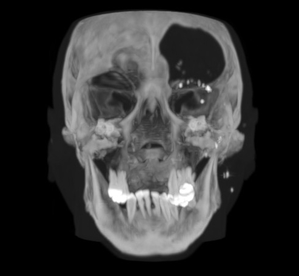{#fig:MIP}

## Personalização de padrão

Alguns padrões podem ser personalizados (ou customizados). Veja a figura
[13.6](#fig:customize_1){reference-type="ref"
reference="fig:customize_1"}, que exibe um padrão e alguns controles
gráficos de ajuste. Com eles, é possível alterar a cor de uma dada
estrutura e sua opacidade, determinando como e se ela será exibida.

{#fig:customize_1}

Caso se deseje ocultar uma estrutura, é necessário utilizar o controle
gráfico de ajuste mantendo baixa a opacidade da região correspondente.
No exemplo da figura [13.6](#fig:customize_1){reference-type="ref"
reference="fig:customize_1"}, suponha que se pretende esconder a parte
muscular, que aparece em vermelho. Para isso, basta posicionar o
ponteiro do mouse sobre o ponto em vermelho e, com o botão esquerdo
pressionado, **arrastar** o ponto para baixo, a fim de diminuir a
opacidade (o que equivale a aumentar a transparência). A figura
[13.7](#fig:customize_2){reference-type="ref"
reference="fig:customize_2"} ilustra o resultado.

Nota: O valor *Alpha* indica a opacidade da cor, e o valor *Value*, a
intensidade da cor no pixel.

{#fig:customize_2}

É possível remover ou adicionar pontos no controle gráfico de ajuste.
Para a remoção, basta clicar com o botão **direito** do mouse sobre o
ponto. Para adicionar um novo ponto, clique com o botão **esquerdo**
sobre a linha do gráfico. Pode-se também salvar o padrão resultante,
clicando no atalho que a figura
[13.8](#fig:save_preset){reference-type="ref"
reference="fig:save_preset"} ilustra.

{#fig:save_preset}

Ao salvar o padrão, o InVesalius exibe uma janela como a da figura
[13.9](#fig:save_window_preset){reference-type="ref"
reference="fig:save_window_preset"}. Digite um nome para o padrão
personalizado e clique em **OK**. O padrão salvo estará disponível com
os demais na próxima vez em que o software for aberto.

{#fig:save_window_preset}

## Personalização de padrão com Brilho e Contraste

É possível personalizar um padrão sem utilizar o controle gráfico de
ajuste, apresentado na seção anterior. Isso é feito por meio do controle
de brilho e **Contraste** presente na barra de ferramentas. Para ativar
o controle, clique no atalho ilustrado pela figura
[13.10](#fig:tool_contrast_original_vol){reference-type="ref"
reference="fig:tool_contrast_original_vol"}.

{#fig:tool_contrast_original_vol}

Com o controle ativado, arrastando o mouse com o botão esquerdo
pressionado sobre a janela do volume, é possível alterar os valores de
*window width* e *window level*. O procedimento é o mesmo aplicado para
as fatias 2D, visto na seção [6.7](#sec:ww_wl){reference-type="ref"
reference="sec:ww_wl"}. Arrastando o mouse na direção horizontal,
altera-se o valor de *window level*. Para a esquerda, diminui-se seu
valor e, para a direita, aumenta-se seu valor. Arrastando o mouse na
direção vertical, altera-se o valor de *window width*. Para baixo,
diminui-se seu valor e, para cima, aumenta-se seu valor.

Com a manipulação desses valores, conseguem-se diferentes resultados de
visualização. Por exemplo, para adicionar tecido à visualização,
**arraste** o mouse diagonalmente, do canto inferior direito para o
canto superior esquerdo da janela de visualização. Para remover tecido
da visualização, faça o contrário, ou seja, **arraste** o mouse
diagonalmente, do canto superior esquerdo para o canto inferior direito.
Veja a figura [13.11](#fig:raycasting_add){reference-type="ref"
reference="fig:raycasting_add"}.

<figure id="fig:raycasting_add">

<figcaption>Adição de tecido</figcaption>
</figure>

## Corte

Em visualização volumétrica, o corte é utilizado para visualizar uma
região interna do volume. O InVesalius dispõe de uma ferramenta para
corte com base em um plano de referência. Com um padrão de visualização
selecionado, clique em **Ferramentas** e, em seguida, em **Plano para
corte** (figura [13.12](#fig:activate_cut_plane){reference-type="ref"
reference="fig:activate_cut_plane"}).

{#fig:activate_cut_plane}

Uma representação do plano para corte é exibida junto ao volume. Para
realizar o corte, mantenha o botão **esquerdo** pressionado sobre o
plano e **arraste** o mouse. Para rotacionar o plano, mantenha o botão
**esquerdo** pressionado sobre a sua borda e movimente o mouse na
direção desejada. Veja um exemplo na figura
[13.13](#fig:cutted_image){reference-type="ref"
reference="fig:cutted_image"}.

{#fig:cutted_image}

Para desativar o recurso de corte, clique novamente em **Ferramentas** e
em **Plano para corte** (figura
[13.12](#fig:activate_cut_plane){reference-type="ref"
reference="fig:activate_cut_plane"}).

# Visualização Estereoscópica

O InVesalius suporta visualização estereoscópica de modelos 3D, para
isso é necessário criar uma superfície (ver
capítulo [9](#cap_surface){reference-type="ref"
reference="cap_surface"}) ou uma visualização volumétrica ativa (ver
capítulo [13](#cap:vis_vol){reference-type="ref"
reference="cap:vis_vol"}), em seguida ir clicar no ícone que a
figura [14.1](#fig:ster){reference-type="ref" reference="fig:ster"}
mostra, no lado direito parte inferior do InVesalius e escolher o tipo
de projeção desejada (figura [14.2](#fig:st_menu){reference-type="ref"
reference="fig:st_menu"}).

{#fig:ster}

{#fig:st_menu}

O InVesalius suporta os seguintes tipos de visualização estereoscópica:

-   Vermelho e azul

-   Anaglifo

-   *CristalEyes*

-   Entrelaçado

-   Esquerda

-   Direita

-   Dresden

-   Checkboard

A figura [14.3](#fig:st_surf_methods){reference-type="ref"
reference="fig:st_surf_methods"} apresenta três diferentes tipos de
projeções.

<figure id="fig:st_surf_methods">

<figcaption>Exemplo de diferentes métodos de estereoscópica aplicado em
uma superfície.</figcaption>
</figure>

# Exportando dados

Com o InVesalius, é possível exportar dados para outros softwares, em
formatos de arquivo como OBJ, STL, entre outros.

O menu que contém as opções para exportação localiza-se no painel
esquerdo do InVesalius, dentro do item **4. Exporte os dados**. Caso o
menu não esteja visível, dê um clique duplo com o botão **esquerdo** do
mouse sobre o item para expandi-lo. A figura
[15.1](#fig:data_export){reference-type="ref"
reference="fig:data_export"} mostra esse menu.

{#fig:data_export}

## Superfície

Para exportar uma superfície, é necessário selecioná-la no menu de
dados, conforme mostra a figura
[15.2](#fig:data_export_selection){reference-type="ref"
reference="fig:data_export_selection"}.

{#fig:data_export_selection}

Em seguida, clique sobre o ícone que a figura
[15.3](#fig:surface_export_original){reference-type="ref"
reference="fig:surface_export_original"} ilustra.

{#fig:surface_export_original}

Na janela exibida (figura
[15.4](#fig:export_data_window){reference-type="ref"
reference="fig:export_data_window"}), insira o nome do arquivo e
selecione o formato desejado para a exportação. Em seguida, clique em
**Salvar**.

{#fig:export_data_window}

Os tipos de arquivo que podem ser exportados estão listados na tabela
[15.1](#tab:files_export_list){reference-type="ref"
reference="tab:files_export_list"}:

::: {#tab:files_export_list}
  Formato                                Extensão  
  ------------------------------------- ---------- --
  Inventor                                 .iv     
  Polygon File Format                      .ply    
  Renderman                                .rib    
  Stereolithography (formato binário)      .stl    
  Stereolithography (formato ASCII)        .stl    
  VRML                                    .vrml    
  VTK PolyData                             .vtp    
  Wavefront                                .obj    

  : Formatos de arquivo que o InVesalius exporta
:::

[]{#tab:files_export_list label="tab:files_export_list"}

## Imagem

É possível exportar imagens de qualquer das orientações de exibição
(axial, coronal, sagital e 3D). Para isso, clique com o botão
**esquerdo** do mouse sobre o atalho exibido na figura
[15.5](#fig:menu_save_image_window){reference-type="ref"
reference="fig:menu_save_image_window"} e selecione a sub-janela
correspondente à imagem que deseja exportar.

{#fig:menu_save_image_window}

Na janela exibida (figura
[15.6](#fig:save_image_window){reference-type="ref"
reference="fig:save_image_window"}), selecione o formato do arquivo e
clique no botão **Salvar**.

{#fig:save_image_window}

# Customização

Algumas opções de customização estão disponíveis para o usuário do
InVesalius. Elas são apresentadas a seguir.

## Menu de ferramentas

Para ocultar/exibir o menu lateral de ferramentas, clique sobre o botão
que a figura [16.1](#fig:layout_full_original){reference-type="ref"
reference="fig:layout_full_original"} ilustra.

{#fig:layout_full_original}

Com o menu ocultado, amplia-se a área da janela do InVesalius disponível
para a visualização das imagens, conforme mostra a figura
[16.2](#fig:closed_tool_menu){reference-type="ref"
reference="fig:closed_tool_menu"}.

{#fig:closed_tool_menu}

## Posicionamento automático de volume/superfície

Para acertar automaticamente a posição de visualização de um volume ou
superfície, pode-se clicar sobre o ícone apresentado na figura
[16.3](#fig:3d_automatic_position){reference-type="ref"
reference="fig:3d_automatic_position"} (localizado no canto inferior
direito da tela do InVesalius) e escolher uma das opções de visualização
disponíveis.

{#fig:3d_automatic_position}

## Cor de fundo da janela de volume/superfície

Para alterar a cor de fundo da janela de volume/superfície, clique no
atalho que a figura
[16.4](#fig:button_select_color_2){reference-type="ref"
reference="fig:button_select_color_2"} mostra. O atalho também está
localizado no canto inferior direito da tela do InVesalius.

{#fig:button_select_color_2}

Uma janela para seleção de cor se abre, como aparece na figura
[16.5](#fig:color_window_background){reference-type="ref"
reference="fig:color_window_background"}. Após isso, basta clicar sobre
a cor desejada e, em seguida, clicar em **OK**.

{#fig:color_window_background}

A figura [16.6](#fig:background_color){reference-type="ref"
reference="fig:background_color"} mostra um exemplo dessa janela com a
cor de fundo alterada.

{#fig:background_color}

## Exibir/ocultar textos em janela 2D

Para exibir ou ocultar os textos que aparecem nas janelas de imagens 2D,
clique no atalho exibido na figura
[16.7](#fig:text){reference-type="ref" reference="fig:text"}, localizado
na barra de ferramentas.

{#fig:text}

As figuras [16.8](#fig:text_on){reference-type="ref"
reference="fig:text_on"} e [16.9](#fig:text_off){reference-type="ref"
reference="fig:text_off"} ilustram, respectivamente, a exibição dos
textos habilitada e desabilitada.

{#fig:text_on}

{#fig:text_off}

# Neuronavegação {#sec:neuronavegador}

A introdução sobre a neuronavegação é feita na
seção [2.1.5](#sec:neuronavegador_intro){reference-type="ref"
reference="sec:neuronavegador_intro"}, é recomendável a leitura caso não
tenha sido feita.

Para utilizar o neuronavegador, é necessário habilitar o modo de
neuronavegação do InVesalius selecionando no menu **Modo** em seguida
**Navegação** (figura [17.1](#fig:nav_menu_pt){reference-type="ref"
reference="fig:nav_menu_pt"}). Será ativada uma nova aba \"Sistema de
navegação\" que ficará visível no painel à esquerda da janela principal
como é apresentado na
figura [17.2](#fig:nav_painel_pt){reference-type="ref"
reference="fig:nav_painel_pt"}.

{#fig:nav_menu_pt}

{#fig:nav_painel_pt}

## Rastreadores espaciais e modo de referência

O sistema de neuronavegação se comunica com vários sistemas de
rastreamento espacial. Atualmente, suporta os dispositivos fabricados
pela ClaroNav (figura [17.3](#fig:tracker_claron){reference-type="ref"
reference="fig:tracker_claron"}) e Polhemus
(figura [17.4](#fig:tracker_polhemus){reference-type="ref"
reference="fig:tracker_polhemus"}).

O usuário deve selecionar o dispositivo correspondente no botão
**Selecione o rastreador:**,
figura [17.5](#fig:nav_select_tracker){reference-type="ref"
reference="fig:nav_select_tracker"}. Caso o usuário não possua nenhum
dos rastreadores suportados e deseja realizar um teste do sistema, deve
selecionar a opção **Depurar rastreador** e realizar normalmente os
procedimentos que serão citados a seguir. Nessa opção, trata-se de uma
simulação, do qual serão geradas coordenadas aleatórias.

{#fig:tracker_claron}

{#fig:tracker_polhemus}

{#fig:nav_select_tracker}

É possível realizar a navegação com dois diferentes tipos de referência,
estático e dinâmico
(figura [17.6](#fig:nav_menu_ref){reference-type="ref"
reference="fig:nav_menu_ref"}). No modo estático as coordenadas do
dispositivo de rastreamento são detectadas com apenas uma sonda. Este
modo de navegação é chamado de modo de referência estática porque a
cabeça dos sujeitos deve permanecer estática na posição em que foram
detectados os pontos fiduciais (Mais informações na
seção [17.2](#sec:corregistro){reference-type="ref"
reference="sec:corregistro"}). Para evitar problemas relacionados com o
movimento da cabeça, alguns dispositivos de rastreamento fornecem uma
sonda de referência. A sonda de referência pode ser ligada a uma parte
não móvel da cabeça, por exemplo testa, para acompanhar as translações e
rotações durante o procedimento de navegação. O uso de uma sonda de
referência é o chamado modo de referência dinâmica.

{#fig:nav_menu_ref}

## Corregistro {#sec:corregistro}

O objetivo do corregistro é estabelecer uma relação entre o espaço de
coordenadas do rastreador espacial e o espaço de coordenadas virtual
(imagem). Para realizar o corregistro, o usuário deve selecionar três
marcadores fiduciais na imagem, para isso primeiramente deverá ativar o
recurso de **Correspondência entre as orientações axial, sagital e
coronal** (ver seção [6.2](#sec:corresp_all_orient){reference-type="ref"
reference="sec:corresp_all_orient"}), coletar as três coordenadas
fiduciais usando a sonda do dispositivo de rastreamento. Os fiduciais
mais utilizados são o trago auricular esquerdo, trago auricular direito
e a fossa nasal. A
figura [17.7](#fig:nav_selec_coord){reference-type="ref"
reference="fig:nav_selec_coord"} ilustra a coleta dos pontos fiduciais.
Quando é selecionado algum ponto fiducial na imagem, automaticamente é
criado um marcador (esfera da cor verde) no volume,
figura [17.8](#fig:nav_balls_in_head){reference-type="ref"
reference="fig:nav_balls_in_head"}.

{#fig:nav_selec_coord}

As siglas dos botões para coleta dos fiduciais representam:

-   OEI: trago auricular esquerdo na imagem

-   ODI: trago auricular direito na imagem

-   NAI: fossa nasal na imagem

-   OER: trago auricular esquerdo no rastreador

-   OER: trago auricular direito no rastreador

-   NAR: fossa nasal esquerdo no rastreador

{#fig:nav_balls_in_head}

## Erro de registro fiducial e navegação

Após o usuário selecionar os três pontos fiduciais na imagem e os
respectivos pontos com o rastreador espacial, o próximo passo é clicar
no **botão Navegar** e o procedimento de navegação será iniciado. Para
pausar a navegação, basta clicar novamente no **botão Navegar**.
Automaticamente após selecionado a navegação é calculado o erro de
registro fiducial, conhecido como *Fiducial Registration Error* (FRE).
Esse erro representa a distância média quadrática do ponto fiducial na
imagem com o respectivo ponto fiducial obtido após realizado o
corregistro.

Ao lado do botão de navegação, há a caixa de texto respectivo ao FRE. Se
o FRE apresentar um valor alto (acima de 3 mm) a navegação não será
precisa e a caixa de texto ficará vermelha,
figura [17.9](#fig:nav_fre_error){reference-type="ref"
reference="fig:nav_fre_error"}, recomenda-se que o corregistro seja
refeito. Caso contrário, para FRE menor que 3 mm a caixa de texto fica
verde, representando que a navegação terá precisão aceitável,
figura [17.10](#fig:nav_fre_ok){reference-type="ref"
reference="fig:nav_fre_ok"}.

{#fig:nav_fre_error}

{#fig:nav_fre_ok}

## Marcadores

Durante a navegação, é possível criar marcadores esféricos no volume 3D.
Para acessar essa função, basta clicar na aba **Ferramentas extras**,
figura [17.11](#fig:nav_extra_tools){reference-type="ref"
reference="fig:nav_extra_tools"}.

{#fig:nav_extra_tools}

A criação de marcadores pode ser executada clicando no botão
correspondente, com isso será criado um marcador na posição da cruz
vermelha com as características escolhidas na aba,
figura [17.11](#fig:nav_extra_tools){reference-type="ref"
reference="fig:nav_extra_tools"}. O número 4 representa o tamanho do
raio da esfera que será criada. Ao lado do tamanho do marcador é
possível definir a cor da esfera
(figura [17.12](#fig:nav_vol_with_markers){reference-type="ref"
reference="fig:nav_vol_with_markers"}).

Caso o usuário desejar identificar o marcador criado no volume, um
**clique duplo com o botão esquerdo do mouse** deve ser realizado no
marcador desejado, com isso o respectivo começará a piscar.

É possível criar uma identificação para o marcador, para isso, deve-se
clicar com o botão direto sobre o marcador desejado e selecionar
**Editar ID**,
figura [17.13](#fig:nav_id_list_markers){reference-type="ref"
reference="fig:nav_id_list_markers"}, será aberto uma janela para o
usuário digitar a identificação,
figura [17.14](#fig:nav_edit_id_markers){reference-type="ref"
reference="fig:nav_edit_id_markers"}.

{#fig:nav_vol_with_markers}

{#fig:nav_id_list_markers}

{#fig:nav_edit_id_markers}

A exportação dos marcadores é feita através do **botão salvar**, a
extensão do arquivo gerado é o .mks. Essa extensão de arquivo pode ser
aberta por processadores de texto como bloco de notas. O arquivo possui
as coordenadas $X$, $Y$ e $Z$ seguido o código $RGB$, tamanho de
marcador e a identificação. Posteriormente, esse arquivo pode ser
importado através do **botão Carregar**.

Caso o usuário desejar excluir apenas um marcador basta **selecionar** o
item desejado na lista e clicar no **botão Remover**, também existe a
opção de excluir todos os marcadores criados, **Deletar todos
marcadores**. Além disso, pode-se ocultar/mostrar a exibição dos
marcadores no volume pelo **botão ocultar/mostrar**.

## Caixas de seleção, trigger externo

Outra maneira para criação de marcadores é a monitoração externa de
trigger. Para ativa-la basta selecionar a caixa de seleção **Trigger
externo**. Essa função foi desenvolvida para comunicar dispositivos EMT
e criar automaticamente o marcador em posições onde os pulsos foram
aplicados. No entanto, outras aplicações são possíveis de acordo com a
necessidade do usuário. A comunicação com o dispositivo externo é feita
através da porta serial COM1, e basta enviar qualquer sinal do tipo
RS-232 em uma velocidade *baud rate* de 9600 no pino de recepção que
será criado um marcador na atual posição da cruz.

## Câmera do volume

O posicionamento da câmera do volume é atualizado automaticamente, tanto
pela posição da cruz vermelha das fatias quanto pela posição da sonda
durante a navegação. O usuário pode desabilitar a atualização automática
e atualizar a câmera manualmente. O posicionamento será alterado caso o
usuário o fizer na janela de volume. Para isso, basta desmarcar a caixa
de seleção **Câmera do volume**.

\
Paulo Henrique Junqueira Amorim

<paulo.amorim@cti.gov.br>\
Thiago Franco de Moraes

<thiago.moraes@cti.gov.br>\
Fábio de Souza Azevedo

<fabio.azevedo@cti.gov.br>\
André Salles Cunha Peres (Neuronavegador)

<peres.asc@gmail.com>\
Victor Hugo de Oliveira e Souza (Neuronavegador)

<victorhos@hotmail.com>\
Renan Hiroshi Matsuda (Neuronavegador)

<renan_hiroshi@hotmail.com>\
Oswaldo Baffa Filho (Neuronavegador)

<baffa@usp.br>\
Jorge Vicente Lopes da Silva

<jorge.silva@cti.gov.br>\
