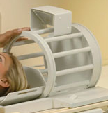
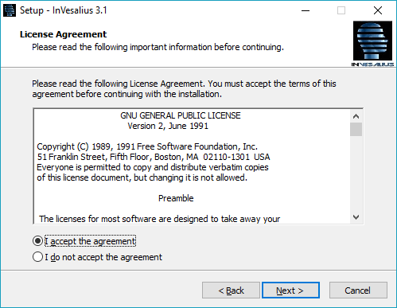
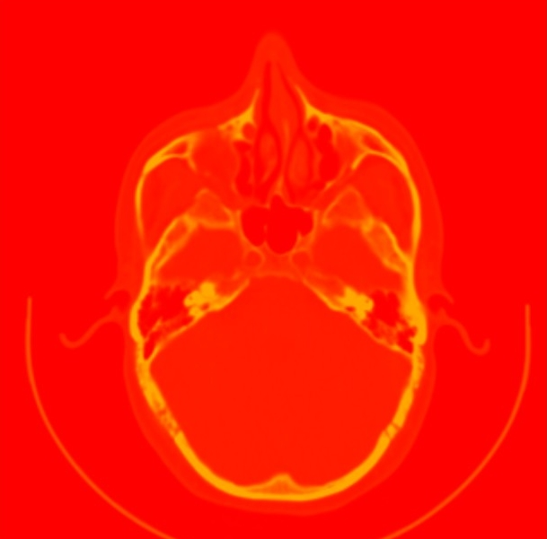
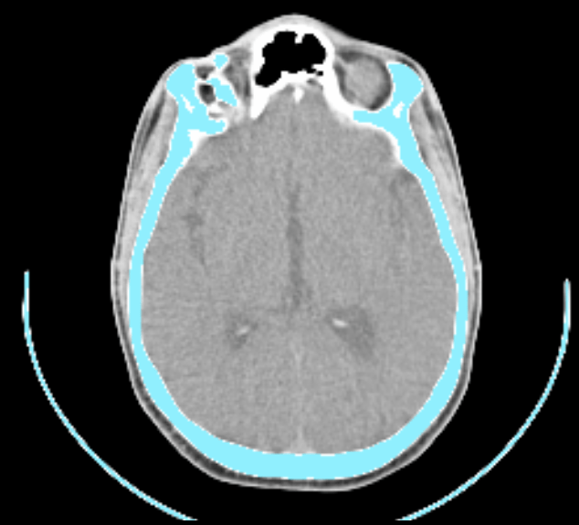
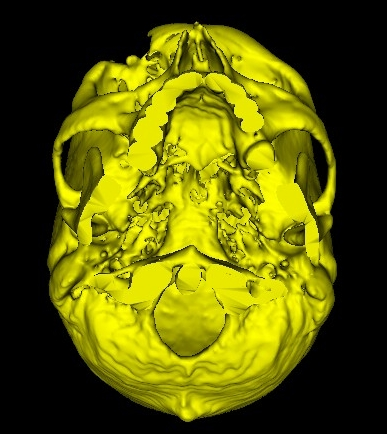
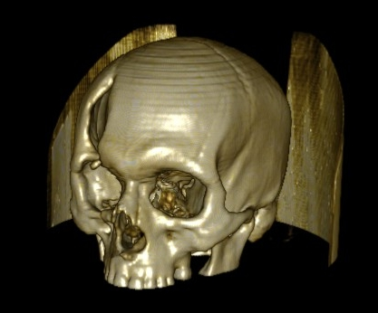

# Introduction {#sec:introduction}

This manual aims to guide end users in the application of InVesalius
tools and also presents some concepts to facilitate the use of the
software.

InVesalius is software that is designed to assist health professionals
on diagnosis and surgical planning. It should be noted, however, that
all software in the diagnostic context is fully supplementary, and each
and every act committed is the responsibility of health professionals.

In addition to medicine, InVesalius can be utilized in other areas such
as archeology, medicine, dentistry, veterinary, or even in industrial
applications. As a basic requirement, the images to be analyzed are in
DICOM (Digital Imaging Communications in Medicine). To date, InVesalius
reconstructs images stemmed from CT scanners and MRI machines. To
operate the software, basic computer literacy is essential.
Understanding medical images can help to form a better understanding of
the operations.

## Important Concepts {#sec:important_concepts}

Detailed in this section are a list of concepts essential to better
understand and operate the software.

### DICOM (*Digital Image Communications in Medicine*) {#sec:dicom}

DICOM is a standard the transmission, storage and treatment of medical
images. The standard encompasses various origins of medical images, such
as images emanating from computed tomography (CT) equipment, magnetic
resonance, ultrasound, and electrocardiogram, among others.

A DICOM image consists of two main components, namely, an array
containing the pixels of the image and a set of meta-information. This
information includes, but is not limited to, patient name, mode image
and the image position in relation to the space (in the case of CT and
MRI).

### Computed Tomography - Medical {#sec:computed_tomography}

Computed tomography indicates the radiodensity of tissues, i.e., the
average X-ray absorption by the tissues. The radiodensity reading is
translated into an image gray levels, called the Hounsfield scale, named
Godfrey Newbold Hounsfield, one of the creators of the first CT scan.

Most modern CT scanning appliances are equipped with a radiation emitter
and a sensor bank (with channels ranging from 2 to 256), which circle
the patient while the stretcher is moved, forming a spiral. This
generates a large number of images simultaneously, with little emission
of X-rays.

#### Hounsfield Scale {#sec:hounsfield}

As mentioned in the previous section, the CT images are generated in
gray levels, expressed in Hounsfield (HU), wherein lighter shades
represent denser matters, and the darker, less dense matter such as skin
and brain tissues.

@tbl:escala_hounsfield presents some materials and their
respective values in Hounsfield Units (HU).

  Material         HU        
  ---------- --------------- --
  Air         -1000 or less  
  Fat             -120       
  Water             0        
  Muscle           40        
  Contrast         130       
  Bone         400 or more   

  : Escala de Hounsfield {#tbl:escala_hounsfield}

### Computed Tomography - Dental (CBCT) {#sec:cbct}

The dental CT commonly works with less radiation emission compared to
medical CT, and therefore makes it possible to view more details of
delicate regions such as alveolar cortical.

Image acquisition is performed with the patient positioned vertically
(as opposed to medical tomography in which the patient is horizontal). A
transmitter X-ray surround the patient's skull, forming an arc of
$180^\circ$ or $360^\circ$. The images generated are compiled as a
volume of the patient's skull. This volume is then \"sliced\" by the
software into individual layers, being able to generate images with
different spacing or fields of view, such as a panoramic view of the
region of interest.

The images acquired by dental scanners often require more post
processing when it is necessary to separate (segmental) certain
structures using other software such as InVesalius. This is because,
typically, these images have more gray levels than, which makes use of
segmentation patterns (preset) less. Another very common feature in the
images of provincial dental CT scanners is the high presence of speckle
noise and other forms of noise typically caused by the presence of
amalgam prosthetics.

### Magnetic Resonance Imaging - MRI {#sec:mri}

MRI is an examination performed without the use of ionizing radiation.
Instead, it use a strong magnetic field to align the atoms of any
element present in our body, most commonly hydrogen. After alignment,
radio waves are triggered to excite atoms. The sensors measure the time
that the hydrogen atoms take to realign. This makes it possible to
distinguish between different tissues, as different types possess
different quantities of hydrogen atoms.

To avoid interference and improve the quality of the radiofrequency
signal, the patient is placed inside a narrow tube encompassed by the
coil and scanning unit.

### Neuronavigation {#sec:neuronavegador_intro}

Neuronavigation is a technique that allows tracking and localization of
surgical instruments relative to neuronal structures through computer
visualization. In addition, neuronavigation systems a fundamental tool
to aid surgical plan and to increase the accuracy of experiments in
neuroscience, such as transcranial magnetic stimulation (TMS),
electroencephalography (EEG), magnetoencephalography (MEG) and
near-infrared spectroscopy (NIRS). Despite the vast field of
applications, the use of neuronavigation in research centers is limited
by its high cost. InVesalius Navigator offers users a low-cost,
open-source alternative to commercial neuronavigation systems. In this
sense, it is possible to use specific tools for neuronavigation and
still have the possibility of developing features on demand. The
software for neuronavigation is distributed in an executable version
compatible with Windows 7, 8 and 10 operating system. The
@sec:neuronavegador goes into details of all features of
neuronavigation in InVesalius.

## Resources needed {#sec:resources_needed}

InVesalius is designed to run on personal computers, such as desktops
and notebooks. Currently, it is compatible with the following operating
systems:

-   Microsoft Windows (Windows 7, 8, 10)

-   GNU/Linux (Ubuntu, Mandriva, Fedora)

-   Apple Mac OS X

The performance of InVesalius depends mainly on the amount of
reconstructed slices (images offered by the software), the amount of
random access memory (RAM) available, the processor clock rate &
frequency, and operating system architecture (32-bit or 64-bit).

It is important to note that, as a general rule, the greater the amount
of RAM available on the system, the greater the number of slices that
can be opened simultaneously. For example, with 1 GB of available
memory, it can open about 300 slices with a resolution of 512x512
pixels. With 4 GB of memory, around 1000 images can be opened
simultaneously at the same resolution.

### Minimum settings {#sec:minimum_settings}

-   32-bit Operating System

-   Intel Pentium 4 or equivalent 1.5 GHz

-   1 GB of RAM

-   10 GB available hard disk space

-   Graphics card with 64 MB memory

-   Video resolution of 1024x768 pixels

### Recommended settings {#sec:recommended_settings}

-   64-bit Operating System

-   Intel Core 2 Duo processor or equivalent 2.5 GHz

-   8 GB of RAM

-   20 GB available hard disk space

-   NVidia or ATI graphics card with 128 MB of memory

-   Video resolution of 1920x1080 pixels

# Installation {#sec:installation}

## MS-Windows {#sec:ms_windows}

To install InVesalius on MS-Windows, simply run the installer program.
When a window asking you to confirm the file execution appears, click
**Yes**.

A new window will ask you to select the language of the installer.
Select the language and click **OK**.

The Setup installer will appear. Click **Next**.

Select **I accept the agreement** and click on **Next** button.

Select the preferred destination for the InVesalius program files, then
click **Next**.

Click on **Next** button.

Select **Create a desktop shortchut** and click on **Next**.

Click on **Install** button.

While the software is being installed, a progress window will appear.

To run InVesalius after installation, check **Lauch InVesalius 3.1** and
click on **Finish** button.

When being run for the first time, a window will appear to select the
InVesalius language. Select the desired language and click **OK**.

While InVesalius is loading, the opening window shown below will be
displayed.

The main program window will then open, as shown below.

## Mac Os X {#sec:macos}

To start the installation on Mac OS X, double-click the installer with
the left mouse button to begin installation.

Hold down the left button on the InVesalius software icon and drag it to
the Applications folder. Both are contained in the installer.

The software is already installed, just access through the menu.

# Image import {#sec:image_import}

InVesalius imports files in DICOM format, including compressed files
(lossless JPEG), Analyze (Mayo Clinic©), NIfTI, PAR/REC,
BMP, TIFF, JPEG and PNG formats.

## DICOM {#sec:image_import_dicom}

Under the File menu, click on Import DICOM or use the shortcut Ctrl+I.
Additionally, DICOM files can be imported by clicking on the icon shown
in @fig:import.

{#fig:import}

Select the directory containing the DICOM files, as in
@fig:win_folder. InVesalius will search for files also in
subdirectories of the chosen directory, if they exist.

Once the directory is selected, click **OK**.

{#fig:win_folder}

While InVesalius search for DICOM files in the directory, the loading
progress of the scanned files is displayed, as shown in the
@fig:ver_file.

{#fig:ver_file}

If DICOM files are found, a window open (shown
@fig:win_import) will open to select the patient and
respective series to be opened. It is also possible to skip images for
reconstruction.

{#fig:win_import}

To import a series with all images present, click \"**$+$**\" on the
patient's name to expand the corresponding series. Double-click on the
description of the series. See
@fig:import_serie.

{#fig:import_serie}

In some cases, when there is no computer with memory and/or satisfactory
processing to work with large numbers of images in a series, it is
recommended to skip some of them. To do this, click **once** with the
**left** mouse button over the description of the series
(@fig:import_serie) and select how many images will be
skipped (@fig:skip_image), then click **Import**.

{#fig:skip_image}

If there is an insufficient amount of available memory at the time of
loading the images it is recommended that the resolution of the slices
be reduced to work with volumetric and surface visualization, as shown
in @fig:resize_image. The slices will be resized according to
the percentage relative to the original resolution. For example, if each
slice of the exam the dimension of 512 x 512 pixels and the \"Percentage
of original resolution\" is suggested to be 60 %, each resulting image
will be 307 x 307 pixels. To open with the original pixel resolution,
set the percentage to 100.

{#fig:resize_image}

If the image was obtained with the gantry tilted it will be necessary to
correct to avoid distortion of any reconstruction. InVesalius allows the
user to do this easily. When importing an image with the gantry tilted a
dialog will appear, showing the gantry tilt angle.
(@fig:gantry_tilt). It is possible to change this value, but
it is not recommended. Click on the **Ok** to do the correction. If you
click on the **cancel** button the correction will not be done.

{#fig:gantry_tilt}

After the above procedure, a window will be displayed (@fig:prog_recons) with reconstruction (when images are
stacked and interpolated).

{#fig:prog_recons}

## Analyze {#sec:image_import_analyze}

To import Analyze files, under the **File** menu, click **Import other
files**, then click in the **Analyze** option as show the
@fig:analyze_menu.

{#fig:analyze_menu}

Select the Analyze file format (**.hdr**) and click on **Open**
(@fig:analyze_import).

{#fig:analyze_import}

## NIfTI {#sec:image_import_nifti}

To import NIfTI files, under the **File** menu, click **Import other
files** and then click **NIfTI** as shown in
@fig:import_nifti_menu_pt.

{#fig:import_nifti_menu_pt}

Select the NIfTI file format, (either **nii.gz** or **.nii**) then click
**Open**
(@fig:import_nifti_window_pt). If the file is in another
format as **.hdr**, select **all files(\*.\*)** option.

{#fig:import_nifti_window_pt}

## PAR/REC {#sec:image_import_parrec}

To import PAR/REC file, under the **File** menu, click **Import other
files**, and then click on **PAR/REC** as shown in
@fig:import_parrec_menu_pt.

{#fig:import_parrec_menu_pt}

Select PAR/REC file type, with the file extension **.par** and click
**Open**
(@fig:import_parrec_window_pt). If the file has no extension,
select **all files(\*.\*)** option.

{#fig:import_parrec_window_pt}

## TIFF, JPG, BMP, JPEG or PNG (micro-CT) {#sec:image_import_microct}

TIFF, JPG, BMP, JPEG or PNG file format for microtomography equipment
(micro-CT or $\mu$CT) or others. InVesalius imports files in these
formats if pixels present are represented in **grayscale**.

To import, click on menu **File**, **Import other files\...** and then
click on **TIFF, JPG, BMP, JPEG ou PNG ($\mu$CT)** option as shown the
@fig:import_bmp_menu_pt.

{#fig:import_bmp_menu_pt}

Select the directory that contains the files, as shown the
@fig:import_bmp_select_folder. InVesalius will search for
files also in subdirectories of the chosen directory, if they exist.

Click on **OK**.

{#fig:import_bmp_select_folder}

While InVesalius is looking for TIFF, JPG, BMP, JPEG, or PNG files in
the directory, the upload progress of the scanned files is displayed, as
illustrated in
@fig:import_bmp_load_pt.

{#fig:import_bmp_load_pt}

If files in the desired formats are located, a window will open (shown
in @fig:import_bmp_window_pt) to display the files eligible for
reconstruction. Images can also be skipped to remove files from the
rebuild list. The files are sorted according to file names. It is
recommended that the files are numbered according to the desired rebuild
order.

{#fig:import_bmp_window_pt}

To delete files that are not of interest, select a file by clicking the
left mouse button and then pressing the delete key. You can also choose
a range of files to delete by clicking the **left mouse button** on a
file, holding down the **shift** key, clicking again with the mouse
button in the last file of the track and finally pressing the **delete**
button.

Similar to when importing DICOM files, you can skip BMP images for
re-building. In some cases, particularly where a computer with
satisfactory memory and/or processing is unavailable, it may be
advisable to skip some of them to retain adequate program functionality.
To do this, select how many images to skip
(@fig:import_bmp_skip_pt), then click **Import**.

{#fig:import_bmp_skip_pt}

To reconstruct files of this type, a project name must be defined to
indicate the orientation of the images (axial, coronal or sagittal),
voxel spacing ($X$, $Y$ and $Z$) in **mm** as shown in the
@fig:import_bmp_spacing_pt. The voxel spacing in $X$ is the
pixel width of each image, $Y$ the pixel length, and $Z$ represents the
distance of each slice (voxel height).

If the image set consists of microtomography images, more specifically
GE and Brucker equipment, it is possible that InVesalius will read the
text file with the acquisition parameters that normally stay in the same
folder as the images and automatically insert the spacing. This
verification can be done when the values of $X$, $Y$ and $Z$ are
different from \"1.00000000\", otherwise it is necessary to enter the
values of the respective spacing.

**Correct spacing is crucial for correctly importing objects in
InVesalius. Incorrect spacing will provide incorrect measurements.**

Once all parameters have been input, click **OK**.

{#fig:import_bmp_spacing_pt}

If insufficient memory is available when loading images, it is
recommended to reduce the resolution of the slices to work with
volumetric and surface visualization, as shown in
@fig:import_bmp_resize_pt window. The slices will be resized
according to the percentage relative to the original resolution. For
example, if each slice of the exam contains the dimension of $512 x 512$
pixels and the \"Percentage of the original resolution\" is suggested at
60, each resulting image will have $307 x 307$ pixels. If you want to
open with the original resolution set the percentage to $100$.

{#fig:import_bmp_resize_pt}

After the previous steps, wait a moment for the program to complete the
multiplanar reconstruction as shown in
@fig:import_bmp_mpr_pt.png.

{#fig:import_bmp_mpr_pt.png}

# Image adjustment {#sec:image_adjustment}

InVesalius cannot guarantee the correct image order; images may contain
incorrect information, or do not follow the DICOM standard. Therefore,
it is recommended to check if a lesion or an anatomical mark is on the
correct side. If not, it is possible to use the flip image or swap axes
tools. For image alignment, the rotation image tool can be used.

It is possible to mirror the image. To do so, select the **Tools** menu,
click **Image**, then **Flip** and click on one of the following options
(@fig:menu_img_mirroring_axis_pt):

-   Right - Left

-   Anterior - Posterior

-   Top - Botton

{#fig:menu_img_mirroring_axis_pt}

@fig:mirrored shows a comparison between the input image and
the flipped image. All other orientations are also modified when the
image is flipped.

  {#fig:mirrored_input width=45%}
  {#fig:mirrored_flipped width=45%}

Example of a right-left flipped image.

## Swap axes {#sec:swap_axes}

The swap axes tool changes the image orientation, in the case that the
image has been wrongly imported. To perform this, select the **Tools**
menu, click **Image**, then **Swap Axes** and click on one of the
following options
(@fig:menu_invert_axis):

-   From Right-Left to Anterior-Posterior

-   From Right-Left to Top-Bottom

-   From Anterior-Posterior to Top-Bottom

The @fig:invert_axis_axial
and @fig:invert_axis_axial_inverted, shows an example of an
image with inverted axes.

{#fig:menu_invert_axis}

{#fig:invert_axis_axial}

{#fig:invert_axis_axial_inverted}

## Reorient image (Rotate) {#sec:reorient_image}

If it is necessary to align the image with a certain point of reference,
e.g. anatomical marker, use the reorient image tool. To open this tool
select the **Tools** menu, click **Image**, then **Reorient Image**
(@fig:menu_img_reorient).

{#fig:menu_img_reorient}

When this tool is activated a window is opened
(@fig:image_reorient_window) showing orientation and by how
many degrees the image was rotated.

{#fig:image_reorient_window}

To start reorienting the image, define the interpolation method that
will applied after rotation, by default is tricubic interpolation. The
interpolation options are:

-   Nearest Neighbour

-   Trilinear

-   Tricubic

-   Lanczos

Then, select the rotation point by keeping the **left** mouse button
pressed between the two lines intersecting
(@fig:image_reorient_adjust_center) at one orientation, e.g.
axial, coronal or sagittal, and **drag** to the desired point.

{#fig:image_reorient_adjust_center}

To rotate the image it is necessary to keep the **left** mouse button
pressed and **drag** until the reference point or anatomical marker
stays aligned with one of the lines
(@fig:image_reorient_rotated). After the image is in the
desired position, click **Apply** in the parameter window
(@fig:image_reorient_window). This may take a few moments
depending on the image size.
@fig:image_reorient_rotated_applied shows an image
successfully reoriented.

{#fig:image_reorient_rotated}

{#fig:image_reorient_rotated_applied}

# Image Manipulation (2D) {#sec:image_manipulation}

## Multiplanar Reconstruction {#sec:multiplanar_reconstruction}

When images are imported, InVesalius automatically shows its multiplanar
reconstruction in the Axial, Sagittal and Coronal orientations, as well
as a window for 3D manipulation, as seen in
@fig:mpr.

{#fig:mpr}

In addition to creating a multiplanar reconstruction, InVesalius
segments an image, highlighting for example soft tissue bones. The
highlight is represented by the application of colors on a segmented
structure so that the colors form a mask over an image highlighting the
structure (@fig:mpr).This is discussed in more detail in the following
chapters.

To hide the mask, use the data manager, located in the lower left corner
of the screen. Select the **Masks** tab and click once using the
**left** mouse button over the eye icon next to **\"Mask 1\"**, as shown
in @fig:ger_masc.

{#fig:ger_masc}

The eye icon disappears, and the colors of the segmentation mask are
hidden (@fig:mpr_sem_mask).

{#fig:mpr_sem_mask}

### Axial orientation {#sec:axial_orientation}

The axial orientation consists of cuts made transversally to the region
of interest, i.e. parallel cuts to the axial plane of the human body. In
@fig:axial_corte, an axial image of the skull region is
displayed.

{#fig:axial_corte}

### Sagittal orientation {#sec:sagittal_orientation}

The sagittal orientation consists of cuts made laterally in relation to
the region of interest, i.e. parallel cuts to the sagittal plane of the
human body, which divides it into the left and right portions. In
@fig:sagital_slice, a sagittal skull image is displayed.

{#fig:sagital_slice}

### Coronal orientation {#sec:coronal_orientation}

The coronal orientation is composed of cuts parallel to the coronal
plane, which divides the human body into ventral and dorsal halves. In
@fig:coronal_slice is displayed a skull image in coronal
orientation.

{#fig:coronal_slice}

## Correspondence between the axial, sagittal and coronal orientations {#sec:corresp_all_orient}

To find out the common point of intersection of the images in differents
orientations, simply activate the \"Slices cross intersection\" feature
with the shortcut icon located on the toolbar. See
@fig:cross_icon.

{#fig:cross_icon}

When the feature is activated, two cross-sections that intersect
perpendicularly are displayed on each image
(@fig:cross_all). The intersection point of each pair of
segments represents the common point between differents orientations.

To modify the point, hold down the **left** mouse button and **drag**.
Automatically, the corresponding points will be updated in each image.

{#fig:cross_all}

To deactivate the feature, simply click on the shortcut again
(@fig:cross_icon). This feature can be used in conjunction
with the slice editor (which will be discussed later).

## Interpolation {#sec:interpolation}

By default the 2D images visualization are interpolated
(@fig:interp_a). To deactivate this feature, select the
**View** menu and select **Interpolated slices**
(@fig:menu_interpoleted_image_pt). It will then be possible
to visualize each pixel individually as shown in
@fig:interp_b.

**This interpolation is for visualization purposes only, and does not
directly influence segmentation or 3D surface generation.**

{#fig:menu_interpoleted_image_pt}

  {#fig:interp_b width=45%}
  {#fig:interp_a width=45%}

Interpolated and non-interpolated image visualization.

## Move {#sec:move}

To move an image on the screen, use the Move shortcut icon on the
toolbar (@fig:move_icon). Click on the icon to activate, then with
the **left** mouse button on the image, it to the desired direction.
@fig:move_img shows a displaced (moved) image.

{#fig:move_icon}

{#fig:move_img}

## Rotate {#sec:rotate}

Images can be rotated by using the Rorate shortcut on the toolbar
(@fig:rot_icon). To rotate an image, click on the icon and
then with the **left** mouse button **drag** clockwise or anticlockwise
as required.

{#fig:rot_icon}

{#fig:rotate_all}

## Zoom {#sec:zoom}

In InVesalius, there are different ways to enlarge an image. You can
maximize the desired orientation window, apply zoom directly to the
image, or select the region of the image to enlarge. Each of these
methods are detailed below.

### Maximizing orientation windows {#sec:maximizing_orientation_windows}

The main InVesalius window is divided into 4 sub-windows: axial,
sagittal, coronal and 3D. Each of these can be maximized to occupy the
entire area of the main window. To do this, simply **left** mouse click
on the subwindow icon located in the **upper right corner**
(@fig:maximize_window). To restore a maximized window to its
previous size, simply click the icon again.

{#fig:maximize_window}

### Enlarging or shrinking an image {#sec:enlarging_or_shrinking_image}

To enlarge or shrink an image, click on the zoom shortcut icon in the
toolbar (@fig:zoom_icon). Hold down the **left** mouse button on the
image and **drag** the mouse **up** to enlarge or **down** to shrink.

{#fig:zoom_icon}

### Enlarging an image area {#sec:enlarging_image_area}

To enlarging a certain image area, click on the \"Zoom based on
selection\" icon in the toolbar
(@fig:zoom_icon_loc). Position the mouse pointer at the
origin point of the selection, click and hold the **left** mouse button
and **drag** it to the end selection point to form a rectangle
(@fig:zoom_select). Once the left mouse button is released,
the zoom operation will be applied to the selected region
(@fig:zoom_applied).

{#fig:zoom_icon_loc}

{#fig:zoom_select}

{#fig:zoom_applied}

## Brightness and contrast (Windows) {#sec:ww_wl}

To improve image visualization, the *window width* and *window level*
features can be used; these are more commonly known as *brightness and
contrast* or *window* (for radiologists). With this feature, it is
possible to set the range of the gray scale (*window level*) and the
width of the scale (*window width*) to be used to display the images.

The feature can be activated by the \"Brightness and Contrast\" shortcut
icon in the toolbar. See
@fig:window_level_shortcut.

{#fig:window_level_shortcut}

To increase the brightness, hold down the **left** mouse button and
**drag** horizontally to the right. To decrease the brightness, simply
drag the mouse to the left. The contrast can be changed by dragging the
mouse (with the **left** button pressed) vertically: up to increase, or
down to decrease contrast.

To deactivate the feature, click again on the shortcut icon
(@fig:window_level_shortcut).

Preset brightness and contrast patterns may be used with InVesalius.
@tbl:window_level lists some tissue types with their
respective brightness and contrast values. To use the presets, position
the mouse cursor over an image and **right-click** to open a context
menu, then select **Window width and level**, and click on the preset
option according to the tissue type, as shown in
@fig:window_level.

{#fig:window_level}

  Tissue                           Brightness   Contrast
  ------------------------------- ------------ ----------
  Default                             Exam        Exam
  Manual                            Changed     Changed
  Abdomen                             350          50
  Bone                                2000        300
  Brain                                80          40
  Brain posterior fossa               120          40
  Contour                             255         127
  Emphysema                           500         -850
  Ischemia - Hard, non contrast        15          32
  Ischemia - Soft, non contrast        80          20
  Larynx                              180          80
  Liver                               2000        -500
  Lung Hard                           1000        -600
  Lung Soft                           1600        -600
  Mediastinum                         350          25
  Pelvis                              450          50
  Sinus                               4000        400
  Vasculature - Hard                  240          80
  Vasculature - Soft                  680         160

  : Brightness and contrast values for some tissues {#tbl:window_level}

  {#fig:contrast_bone width=45%}
  {#fig:contrast_isq width=45%}

Different types of brightness and contrast

## Pseudo color {#sec:pseudo_color}

Another feature to improve the visualization of the images is the pseudo
color. This replaces gray levels by color, or by inverted gray levels.
In the latter case, previously clear regions of the image become darker
and vice versa.

To change the view using a pseudo color, position the mouse cursor over
the image and **right-click** to open a context menu on it. When the
menu opens, select the entry **Pseudo color**, and then click on the
desired pseudo color option, as shown in
@fig:pseudo_color.

{#fig:pseudo_color}

@fig:pseudo_color_types a-g demonstrate the various pseudo color
options available.

  {#fig:image_default width=25%}

  {#fig:image_inverted width=25%}
  {#fig:image_arc width=25%}
  {#fig:image_desert width=25%}

  {#fig:image_matiz width=25%}
  {#fig:image_ocean width=25%}
  {#fig:image_saturation width=25%}

Some different types of pseudo-color

## Projection type {#sec:projection_type}

It is possible to change the projection type of the 2D images, in
addition to the normal mode, InVesalius has six types of projections
that can be accessed as follows: Place the mouse over the image and
**rigth-click** to open a context menu on it. When the menu opens,
select the projection type option, and then click on the desired
projection option, as shown in the
@fig:menu_proj.

{#fig:menu_proj}

### Normal {#sec:projection_type_normal}

Normal mode is the default view, showing the unmodified image as it was
when acquired or customized previously with either brightness and
contrast or pseudo color. Normal mode is shown below in
@fig:proj_normal.

{#fig:proj_normal}

### MaxIP {#sec:max_ip}

MaxIP is also known as MIP (*Maximum Intensity Projection*). MaxIP
selects only voxels that have maximum intensity among those visited as
shown in @fig:proj_maxip. According to the amount of, or \"depth\" of
MaxIP, each voxel is visited in order of overlap, for example, to select
MaxIP of the pixel $(0, 0)$ consisting of 3 slices it is necessary to
visit pixel $(0, 0)$ of slices $(1, 2, 3)$ and select the highest value.

{#fig:proj_maxip}

As shown in @fig:proj_maxip_qtd, the number of MaxIP images is set at
the bottom of each orientation image.

{#fig:proj_maxip_qtd}

### MinIP {#sec:min_ip}

Unlike MaxIP, MinIP (*Minimum Intensity Projection*) selects only the
voxels that have minimal intensity among those visited, as shown in
@fig:proj_minIP. The image number selection comprising the
projection is made at the bottom of each orientation image as shown in
@fig:proj_maxip_qtd.

{#fig:proj_minIP}

### MeanIP {#sec:mean_ip}

The MeanIP (*Mean Intensity Projection*) technique which is shown in the
@fig:proj_meanIP composes the projection by averaging voxels
visited in the same way as the MaxIP and MinIP methods. It is also
possible to define how many images will compose the projection at the
bottom of the image of each orientation as shown in
@fig:proj_maxip_qtd.

{#fig:proj_meanIP}

### MIDA {#sub:mida}

The MIDA (*Maximum Intensity Difference Accumulation*) technique
projects an image taking into account only voxels that have local
maximum values. From each pixel a ray is simulated towards the volume,
with each voxel being intercepted by each ray reaching the end of the
volume. Each of the voxels visited has its accumulated value, but are
taken into account only if the value is greater than previously visited
values. Like MaxIP, one can select how many images are used to
accumulate the values.
@fig:proj_MIDA shows an example of MIDA projection.

{#fig:proj_MIDA}

As @fig:proj_MIDA_inv shows, it is possible to invert the order
that the voxels are visited by selecting the **Inverted order** option
in the lower corner of the screen.

{#fig:proj_MIDA_inv}

### Contour MaxIP {#sec:contour_maxip}

The Contour MaxIP function consists of visualizing contours present in
the projection generated with MaxIP
technique(@sec:max_ip). An example is presented in
@fig:proj_contorno_maxip.

{#fig:proj_contorno_maxip}

### Contour MIDA {#sec:contour_mida}

The Contour MIDA function consists of visualizing contours present in
the projection generated with the MIDA
technique([5.9.5](#sub:mida){reference-type="ref"
reference="sub:mida"}). Like MIDA, you can reverse the order that the
volume is visited, as shown in
@fig:proj_contorno_mida.

{#fig:proj_contorno_mida}

# Segmentation {#sec:segmentation}

To select a certain type of tissue from an image it is used the
segmentation feature at InVesalius.

## Threshold {#sec:threshold}

When using the thresholding segmentation technique, only the pixels
whose intensity is inside the threshold range defined by the user are
detected. The threshold is defined by two values, the initial (minimum)
and final (maximum) threshold.

In thresholding segmentation technique only the *pixels* whose intensity
is inside threshold range defined by the user. Threshold is defined by
two number, the initial and final threshold, also known as minimum and
maximum threshold. \...

Thresholding segmentation is located the InVesalius left-panel, item
**2. Select region of interest**
(@fig:region_selection).

{#fig:region_selection}

Before starting a segment it is necessary to configure a mask. A mask is
a image over to examine an image where the selected regions are colored.
(@fig:region_selection_masc).

{#fig:region_selection_masc}

To change the threshold, use the image greyscale control
(@fig:region_selection_bar). Move the *left* sliding control
to change the initial threshold. Move the **right** sliding control to
change the final threshold. It is also possible to to input the desired
threshold values in the text boxes in the left and right side of the
thresholding control. The mask will be automatically updated when the
thresholding values are changed, showing in color the pixels inside the
thresholding range.

{#fig:region_selection_bar}

It is also possible to select some predefined thresholding values based
on some type of tissues, like those displayed in
@fig:limiar_presets. Just select the desired tissue and the
mask will automatically update.

{#fig:limiar_presets}

@tbl:limiar
show thresholding values according to some tissues or materials.

  Material                 Initial threshold   Final Threshold
  ----------------------- ------------------- -----------------
  Bone                            226               3021
  Compact Bone (Adult)            662               1988
  Compact Bone (Child)            586               2198
  Custom                       User Def.          User Def.
  Enamel (Adult)                 1553               2850
  Enamel (Child)                 2042               3021
  Fat Tissue (Adult)             -205                -51
  Fat Tissue (Child)             -212                -72
  Muscle Tissue (Adult)           -5                 135
  Muscle Tissue (Child)           -25                139
  Skin Tissue (Adult)            -718               -177
  Skin Tissue (Child)            -766               -202
  Soft Tissue                    -700                225
  Spongial Bone (Adult)           148                661
  Spongial Bone (Child)           156                585

  : Predefined thresholding values to some materials {#tbl:limiar}

@tbl:limiar
indicates images obtained from medical tomographs. The range of gray
values from images obtained from odontological tomographs are greater
and non-regular. Thus, it is necessary to use sliding controls
(@fig:region_selection_bar) to adjust the thresholding
values.

To create a new mask, click **Create new mask**
(@fig:shortcut_new_mask). Then, click **Select region of
interest**.

{#fig:shortcut_new_mask}

After clicking on this button a dialog will be shown
(@fig:create_new_mask). Select the desired threshold and
click on **Ok**.

{#fig:create_new_mask}

After segmentation it is possible to generate a corresponding 3D
surface. The surface is formed by triangles. The following chapter will
give more details about surfaces.

Click on the **Create surface** button
(@fig:generate_surface) to create a new surface. If there is
a surface created previously you may overwrite it with the new one. To
do this select the option **Overwrite last surface** before creating the
new surface.

{#fig:generate_surface}

After a few moments the surface will be displayed at the 3D
visualization window of InVesalius
(@fig:surface).

{#fig:surface}

## Manual segmentation (Image edition) {#sec:manual_segmentation}

Thresholding segmentation may not be efficient in some cases since it is
applied to the whole image. Manual segmentation may be used to segment
only an isolated region. Manual segmentation also allows users to add or
remove some image regions from the segmentation. To use it click on
**Manual edition**
(@fig:advanced_edition) to open the manual segmentation
panel.

{#fig:advanced_edition}

@fig:edition_slices_ref show the Manual segmentation panel.

{#fig:edition_slices_ref}

There are two brushes used for segmentation: a circle and a square.
Click on the triangle icon (see
@fig:brush_type) to show brush types, then click on the
desired brush.

{#fig:brush_type}

Brush sizes can also be adjusted, as shown in
@fig:select_diameter.

{#fig:select_diameter}

The following are available options when using brushes in InVesalius:

-   **Draw**: for adding a non-selected region to the segmentation;

-   **Erase**: for removal of a non-selected region;

-   **Threshold**: applies the thresholding locally, adding or removing
    a region inside or outside of the threshold range.

@fig:select_brush_operations shows the available brush
operations.

{#fig:select_brush_operations}

@fig:noise_amalgaman shows a image with noise caused by the
presence of a dental prosthesis. Note the rays emerging from the dental
arch: the thresholding segments the noise since its intensity is inside
of the threshold of bone.

{#fig:noise_amalgaman}

@fig:surface_amagaman shows a surface created from that
segmentation.

{#fig:surface_amagaman}

{#fig:surface_amagaman_zoom}

In such cases use the manual segmentation with the **erase** brush. Keep
the **left** mouse button pressed while dragging the brush over the
region to be removed (in mask).

@fig:editor_amalgaman shows the image from
@fig:noise_amalgaman after.

{#fig:editor_amalgaman}

{#fig:surface_edited_amalgaman}

A surface can be generated after manual segmentation
(@fig:surface_edited_amalgaman). Since it was used in the
manual segmentation procedure, when clicking on Create surface button, a
dialog (@fig:new_surface_edited) will be opened to to select if the
surface will be created with the method **Binary** (blocky) or **Context
aware smoothing (smoother)**.

{#fig:new_surface_edited}

## Watershed {#sec:watershed}

In watershed segmentation the user demarcates objects and background
detail. This method treats the image as watershed (hence the name) in
which the gray values (intensity) are the altitudes, forming valleys and
mountains. The markers are water source. The waters fill the watershed
until the waters gather together, thus distinguishing background from
object. To use Watershed segmentation click on Watershed to open the
watershed panel
(@fig:watershed_painel).

{#fig:watershed_painel}

Before segmenting to with Watershed it recommended to clean the mask
(see section [7.2](#cap:limpeza_mascara){reference-type="ref"
reference="cap:limpeza_mascara"}).

To insert a marker (object or background), a brush is used, similar to
manual segmenting. You can use a circle or square brush and set its
size.

Select brush operations from the following:

-   **Object**: to insert object markers;

-   **Background**: to insert background markers (not object);

-   **Delete**: to delete markers;

The option **Overwrite mask** is used when the user wants the result of
watershed segmentation to overwrite the existing segmentation. The
option **Use WWWL** is used to make watershed take into account the
image with the values of window width and window level (not the raw
image) which may result in better segmentation.

Click on the button on the left side of the panel
(@fig:watershed_conf) to access more watershed
configurations. This button will open a dialog
(@fig:watershed_janela_conf). The method option allows to
choose the Watershed algorithm to be used to segment. It may be the
conventional **Watershed** or **Watershed IFT**, which is based on the
IFT (*Image Forest Transform*) method. In some cases, like brain
segmentation, the **Watershed IFT** may have a better result.

The connectivity option refers to the pixel neighbourhood ($4$ or $8$
when in 2D, or $6$, $18$ or $26$ when in 3D). **Gaussian sigma** is a
parameter used in the smoothing algorithm (the image is smoothed before
the segmentation to remove the noise and get better results). The
greater this value the smoother the smoother the image will be.

{#fig:watershed_conf}

{#fig:watershed_janela_conf}

Normally the **Watershed** is applied only in one slice, not in the
whole image. After adding the markers is possible to apply the watershed
to the whole image by clicking on the button **Expand watershed to 3D**.
@fig:watershed_2d shows the result of watershed segmentation
in a slice (2D) of brain image.

@fig:watershed_3d shows the segmentation expanded to the
whole image (3D).

@fig:watershed_2d also shows the object markers (in light
green), the background markers (in red) and the segmentation mask (in
green) overlaying the selected regions (result).

{#fig:watershed_2d}

{#fig:watershed_3d}

## Region growing {#sec:region_growing}

Region growing tool is accessed in the menu **Tools**, **Segmentation**,
**Region growing**
(@fig:menu_segmentation_region_growing). Before segmenting
select if the operation will be in **2D - Actual slice** or **3D - All
slices**. It is also necessary to select the connectivity: $4$ or $8$ to
2D or $6$, $18$ or $26$ to 3D. It's also necessary to select the method,
which may be **Dynamic, Threshold, or Confidence**
(@fig:segmentation_region_growing_dinamic)

{#fig:menu_segmentation_region_growing}

{#fig:segmentation_region_growing_dinamic}

This segmentation technique starts with a pixel (indicated by the user
left-clicking with the mouse). The selection expands by analyzing the
neighbourhood of the selected pixels and including those of a given set
of qualities. Each region growing method has a different condition of
selection:

-   **Dynamic**: Uses the value of the pixel clicked by the user. Then
    every connected pixel inside the lower (min) and the upper (max)
    range deviation are selected. The option **Use WWWL** is default and
    takes into account the image with **window width** and **window
    level** applied not the raw one
    (@fig:segmentation_region_growing_dinamic_parameter).

    {#fig:segmentation_region_growing_dinamic_parameter}

-   **Threshold**: This method selects the pixels whose intensity are
    inside the minimum and maximum threshold
    (@fig:segmentation_region_growing_limiar).

    {#fig:segmentation_region_growing_limiar}

-   **Confidence**: This method starts by calculating the standard
    deviation and the mean value of the pixel selected by the user and
    its neighbourhood. Connected pixels with value inside the range
    (given by the mean more and less the standard deviation multiplied
    by the **Multiplier** parameter). It then calculates the mean and
    the standard deviation from the selected pixels, then carries out
    the expansion. This process is repeated according to the
    **Iterations** parameter.
    @fig:segmentation_region_growing_confidence_parameter
    shows the parameters for this method.

    {#fig:segmentation_region_growing_confidence_parameter}

# Mask {#sec:mask}

## Boolean operations {#sec:boolean_operations}

After segmenting, some boolean operations can be performed between
masks. The boolean operations supported by InVesalius are:

-   **Union**, perform union between two masks;

-   **Difference**, perform difference from the first mask to the second
    one;

-   **Intersection**, keeps what is common in both masks.

-   **Exclusive disjunction (XOR)**: keeps the regions of the first mask
    which are not in the second mask and regions from the second mask
    which are no in the first mask.

To use this tool go to the **Tools**, menu, select **Mask**, and then
Boolean operations as shown in
@fig:booleano_menu. Select the first mask, the operation to
be performed and the second mask as shown in
@fig:booleano_janela then click **OK**.

{#fig:booleano_menu}

{#fig:booleano_janela}

@fig:op_boolana shows some examples of utilization of
boolean operations tool.

  {#fig:boolana_a width=33%}
  {#fig:boolana_b width=33%}
  {#fig:boolana_union width=33%}

  {#fig:boolana_diff width=33%}
  {#fig:boolana_intersection width=33%}
  {#fig:boolana_exclusive_disjuction width=33%}

Example of boolean operations.

## Mask cleaning {#cap:limpeza_mascara}

A mask can be cleaned, as shown in
@fig:limpeza_mascara. This is recommended before inserting
Watershed markers. This tool is located on the **Tools** menu. Select
**Mask**, then **Clean mask**, or use the shortcut **CTRL+SHIFT+A**.

{#fig:limpeza_mascara}

## Fill holes manually {#sec:fill_holes_manually}

Segmentation may leave some unwanted holes. It's recommended to fill
them because the surface generated from this mask may have some
inconsistencies. To do this access the menu **Tools**, **Mask**, **Fill
holes manually**
(@fig:menu_mask_manual_fill_holes). A dialog window will be
shown
(@fig:mask_manual_fill_holes_window) to configure the
parameters.

{#fig:menu_mask_manual_fill_holes}

{#fig:mask_manual_fill_holes_window}

It is possible to fill hole on a mask slice (**2D - Actual slice**) or
on all slices, selecting the option (**3D - All slices**). The
connectivity may also be configured: $4$ or $8$ for 2D and $6$, $18$ and
$26$ for 3D.

After configuring the desired parameters left-click on holes to fill
them. @fig:mask_fill_hole.a shows a mask with some holes and other
mask with the holes filled
(@fig:mask_fill_hole.b). Click on the close button or close
the dialog to deactivate this tool.

  {#fig:mask_fill_hole.a width=45%}
  {#fig:mask_fill_hole.b width=45%}

Example of mask with holes filled.

## Fill holes automatically {#sec:fill_holes_automatically}

To open this tool go to the **Tools** menu, select **Mask** then **Fill
holes automatically**
(@fig:menu_mask_automatic_fill_holes). This will open a
dialog to configure the parameters. This tool doesn't require the user
to click on holes he desire to fill. This tool will fill the holes based
on the **max hole size parameter** given in number of voxels
(@fig:mask_automatic_fill_holes_window).

{#fig:menu_mask_automatic_fill_holes}

{#fig:mask_automatic_fill_holes_window}

Holes can also be filled on a mask slice (**2D - Actual slice**) or on
all slices, selecting the option (**3D - All slices**. The connectivity
will thus be $4$ or $8$ to 2D and $6$, $18$ and $26$ to 3D. If 2D, the
user must indicate in which orientation window the holes will be filled.

After setting the parameters click **Apply**. If the result is not
suitable set another hole size value or connectivity. Click **Close** to
close this tool.

## Remove parts {#sec:remove_parts}

After generating a surface, it is recommended to remove the unwanted
disconnected parts from a mask. This way the surface generation will use
less RAM and make the process quicker. To remove any unwanted parts, go
to the **Tools** menu, select **Mask** and then **Remove Parts**
(@fig:menu_mask_remove_part). A dialog will be shown to
configure the selection parameters
(@fig:mask_remove_parts_window).

It's possible to select disconnected parts only on a mask slice (**2D -
Actual slice**) or on all slices (**3D - All slices**); users may also
configure the connectivity at the same time.

{#fig:menu_mask_remove_part}

{#fig:mask_remove_parts_window}

After selecting the desired parameters click with the **left-button** of
the mouse on the region you want to remove.
@fig:mask_removed_part shows an example of a mask before and
after the removal of unused parts. Click **Close** to stop using this
tool.

  {#fig:mask_removed_part.a width=45%}
  {#fig:mask_removed_part.b width=45%}

Example of region remove from a mask.

## Select parts {#sec:select_parts}

To open the Select parts tool, access the **Tools** menu, select
**Mask** then **Select parts**
(@fig:menu_mask_select_part). A dialog will be shown to
configure the the name of the new mask and the connectivity ($6$, $18$
or $26$).

To select a region, **left-click** on a pixel; multiple regions can be
selected. The selected region(s) will be shown with a red mask. After
selecting all the wanted regions, click **OK** to create a new mask with
the selected regions.
@fig:mask_selected_part.a shows a region selected in red.
@fig:mask_selected_part.b shows the selected region in a new
mask.

{#fig:menu_mask_select_part}

{#fig:mask_select_part}

  {#fig:mask_selected_part.a width=45%}
  {#fig:mask_selected_part.b width=45%}

Example of mask region selection.

## Crop {#sec:crop}

The crop tool allows users to select and use a specific section of image
of interest. This may reduce the amount of information needed to be
processed when generating a surface. To open, access the **Tool** menu,
then **Mask** and **Crop**
(@fig:menu_mask_crop).

{#fig:menu_mask_crop}

A box allowing for the selection of a specific area will then be
displayed.

# Surface (Triangle mesh) {#cap_surface}

InVesalius, generates 3D surfaces based on image segmentation. A surface
is generated using the marching cubes algorithm by transforming voxels
from the stacked and segmented images to polygons (triangles in this
case).

The controls to configure a 3D surface are accessible on the left panel,
under **3. Configure 3D surface**, **Surface properties** you have the
controls to configure a 3D surface
(@fig:3d_surface_managment).

{#fig:3d_surface_managment}

## Creating 3D surfaces {#sec:create_3d_surfaces}

News surfaces can be created using an already segmented mask. To do so,
on the left panel under **3. Configure 3D surface**, click on the button
shown in @fig:shortcut_new_surface.

{#fig:shortcut_new_surface}

After clicking this button a dialog will be shown
(@fig:create_surface_1). This dialog allows for the
configuration of the 3D surface created, including setting the quality
of the surface, filling surface holes whilst keeping the largest
connected region of the surface intact.

{#fig:create_surface_1}

The keep largest region option may be used, for instance, to remove the
tomograph supports. @fig:surface_ex1 displays a surface created with **Keep
largest region** and **Fill holes** activated, whereas
@fig:surface_ex2 displays the surface create without
activating that options. Note the tomograph support and the holes.

  {#subfig:surface_ex1_frente width=45%}
  {#subfig:surface_ex1_baixo width=45%}

Surface created with the options **Keep largest
region** and **Fill holes** activated.

  {#subfig:surface_ex2_frente width=45%}
  {#subfig:surface_ex2_baixo width=45%}

Surface created with the options **Keep largest region** and **Fill holes**
deactivated.

The **Surface creation method** item has the following options:
**Binary**, **Context aware smoothing** and **Default**.
@fig:surf_method shows an example of surface created using
each of these 3 methods.

The **Binary** method takes as input the segmentation mask which is
binary, where selected regions have value 1 and non-selected have value
0. As it is binary, the surface generated has a blocky aspect, mainly in
high curvature areas, appearing staircases.

**Context aware smoothing** starts generating the surface using Binary,
then uses another algorithm in order to smooth the surface to avoid
staircase details. This method has 4 parameters presented below.

The **angle** parameter is the angle between 2 adjacent triangles. If
the calculated angle is greater than the angle parameter the triangle
will be considered a staircase triangle and will be smoothed. The angle
parameter ranges from $0$ to $1$, where $0$ is $0^\circ$ and $1$ is
$90^\circ$. The **Max distance** is the maximum distance that a
non-staircase triangle may be from a staircase triangle to be considered
to be smoothed. Non-staircase triangles with distance greater than Max
distance also will be smoothed but the smoothing will be determined by
the **Min. weight** parameter. This parameter ranges from $0$ (without
smoothing) to $1$ (total smoothing). The last parameter, **N.steps**, is
the number of times the smoothing algorithm will be run. The greater
this parameter the smoother the surface will be.

The **Default** method is enabled only when thresholding segmentation
was used without any manual modification to the mask. This method does
not use the mask image, but the raw image, and generates a smoother
surface.

  {#fig:surf_binary width=30%}
  {#fig:surf_context width=30%}
  {#fig:surfa_default width=30%}

Surface generated by each method.

## Transparency {#sec:transparency}

The Transparency function allows for the displaying of a surface
transparently. To do so, select the desired surface from the list of
surfaces, in the item **3. Configure 3D surface**, **Surface
properties** (@fig:select_surface).

{#fig:select_surface}

Then, to set the level of surface transparency, use the sliding control
shown in @fig:select_transparency; the more to the right, the more
transparent the surface will be.

{#fig:select_transparency}

@fig:model_transparency shows 2 surfaces: the external
surface in green has some level of transparency which permits to see the
internal surface in yellow.

{#fig:model_transparency}

## Color {#sec:color}

Surface colors can be altered by selecting the surface
(@fig:select_surface), and clicking on the colored button on
the right of the surface selection list.
@fig:change_surface_color displays this button, inside item
**3. Configure 3D surface**, **Surface properties**.

{#fig:change_surface_color}

A dialog will be shown
(@fig:button_select_color). Select the desired color and
click on **OK**.

{#fig:button_select_color}

## Splitting disconnected surfaces {#sec:splitting_disconnected}

To split disconnected surfaces, select **3. Configure 3D surface**,
**Advanced options**
(@fig:advanced_tools).

{#fig:advanced_tools}

The advanced options panel will be displayed
(@fig:advanced_tools_expanded).

{#fig:advanced_tools_expanded}

### Select largest surface {#sec:select_largest_surface}

The option **Select largest surface** selects, automatically, only
surface with the greater volume. Click on the button illustrated in
@fig:short_connectivity_largest. This operation creates new
a surface with only the largest surface.

{#fig:short_connectivity_largest}

As an example, the
@fig:extract_most_region_1 shows a surface before **Select
largest surface**.

{#fig:extract_most_region_1}

Whereas the
@fig:extract_most_region2 shows the surface with largest
disconnected region separated.

{#fig:extract_most_region2}

### Select regions of interest {#sec:select_regions}

Another selection option is Select regions of interest. To do this
operation click on the button illustrated in
@fig:short_connectivity_manual, then click on the desired
disconnected surface regions you want to select. Next click on **Select
regions of interest**. This operation will create a new surface with
only the selected disconnected regions.

{#fig:short_connectivity_manual}

As an example, the
@fig:extract_most_region3 shows the surface created after
the user selects the cranium and the right part of the tomograph
support.

{#fig:extract_most_region3}

### Split all disconnected surfaces {#sec:split_all_disconnected_surfaces}

Disconnected surface regions can also be split automatically. To do
this, click on the button illustrated in
@fig:connectivity_split_all.

{#fig:connectivity_split_all}

@fig:extrac_most_region_4 shows an example.

{#fig:extrac_most_region_4}

# Measures {#sec:measures}

InVesalius has linear and angular measurements in 2D (axial, coronal and
sagittal planes) and 3D (surfaces). It is thus possible to take
measurements of volume and area on surfaces.

## Linear Measurement {#sec:linear_measurement}

To perform linear measurements, activate the feature by clicking on the
shortcut shown below, located on the toolbar
(@fig:measure_line_original).

{#fig:measure_line_original}

A linear measurement is taken between two points. With the feature
enabled, click **once** on the image to set the starting point. Then
position the mouse pointer on the end point and click once again. The
measurement is performed and the result is automatically displayed on
the image or surface

@fig:axial_linear shows a 2D linear measure in the axial
orientation, and @fig:3d_linear shows another linear measure in 3D (surface).

Once you have made a 2D linear measurement, it can be edited by placing
the mouse on one end, holding down the **right mouse button** and
dragging it to the desired position.

{#fig:axial_linear}

{#fig:3d_linear}

**Note: The linear measurement is given in millimeters (mm).**

## Angular Measurement {#sec:angular_measurement}

An angular measurement in 2D on a surface (3D) can be done by clicking
on the shortcut shown in
@fig:atalho_angular.

{#fig:atalho_angular}

To perform the angular measurement, it is necessary to provide the three
points that will describe the angle to be measured, AB̂C. Insert the
first point by clicking once to select point A. Insert point B (the
vertex or \"point\" of the angle) by positioning the cursor and clicking
once again. Repeat the same actions to determine the endpoint of the
angle, C. The resulting measurement is displayed on the image or
surface.

@fig:axial_angular illustrates an angular measurement on a
flat image; @fig:axial_superficie illustrates an angular measurement on
a surface.

In regards to 2D linear measurement, you can also edit the 2D angular
measurement. Just position the mouse on one end, hold down the right
mouse button and drag it to the desired position.

{#fig:axial_angular}

{#fig:axial_superficie}

**Note: Angular measurement is shown in degrees ($^{\circ}$)**

## Volumetric Measurement {#sec:volumetric_measurement}

Volume and area measurements are made automatically when you create a
new surface. These are displayed in the **Surfaces 3D** tab in the
**Data** management panel, located in the bottom left corner of the
screen, as illustrated in
@fig:volumetric_mensure.

{#fig:volumetric_mensure}

**Note: Volume measurement is given in cubic millimeter ($mm^3$),
already the one of area in square millimeter ($mm^2$)**

# Data management {#sec:data_management}

We have previously shown how to manipulate surfaces, masks for
segmentation and measurements. We can also show or hide, and create or
remove these elements in the **Data** management panel, located in the
lower left corner of InVesalius. The panel is divided into 3 tabs:
**Masks**, **3D Surfaces** and **Measurements**, as shown in
@fig:volumetric_data. Each tab contains features
corresponding to the elements it refers to.

{#fig:volumetric_data}

In each tab, there is a panel divided into rows and columns. The first
column of each line determines the visualization status of the listed
element. The \"eye\" icon activates or deactivates the masks, surface or
measurement displayed. When one of these elements is being displayed,
its corresponding icon (as shown in
@fig:disable_mask) will also be visible.

{#fig:disable_mask}

Some operations may be performed with the data. For instance, to remove
one element, first select its name, as shown in
@fig:selected_mask. Next, click in the shortcut shown in
@fig:delete_data.

{#fig:selected_mask}

{#fig:delete_data}

To create a new mask, surface or measurement, click on the shortcut
shown in @fig:new_data, provided that the corresponding tab is open.

{#fig:new_data}

To duplicate data, select data to be duplicated and click in the
shortcut shown in
@fig:duplicate_data.

{#fig:duplicate_data}

## Masks {#sec:masks}

In the Name column, the mask's color and name are shown. The
**Threshold** column shows the value range used to create the mask.
@fig:volumetric_data shows an example.

## 3D Surface {#sec:3d_surfaces}

In the **Name** column, the surface's color and name are shown. The
**Volume** column shows the total surface volume. Finally, the
**Transparency** column indicates the level of transparency for use for
surface visualization.
@fig:surface_manager shows an example.

{#fig:surface_manager}

### Import surface {#sec:import_surface}

We can also import STL, OBJ, PLY or VTP (VTK Polydata File Format) files
into an active InVesalius project. To do so, click in the icon shown in
@fig:import_stl, select the format of the corresponding
file, (@fig:import_surface) and click Open.

{#fig:import_stl}

{#fig:import_surface}

## Measurements {#sec:measurements}

The tab Measurements shows the following information. **Name** indicates
the color and measurement name. **Local** indicates where the
measurement was taken (image axial, coronal, sagital or 3D), and
**Type** indicates the type of measurement (linear or angular). Finally,
**Value** shows the measurement value.
@fig:manager_mensuares illustrates the **Measurements** tab.

{#fig:manager_mensuares}

# Simultaneous viewing of images and surfaces {#sec:simultaneous_viewing_images_surface}

Images and surfaces can be viewed simultaneously by **left-clicking** on
the shortcut
(@fig:slice_plane_original) located in the lower right corner
of the InVesalius interface.

{#fig:slice_plane_original}

This feature allows users to enable or disable the displaying of images
in different orientations (or plans) within the same display window of
the 3D surface. Simply check or uncheck the corresponding option in the
menu shown in @fig:view_2d_3d_1.

{#fig:view_2d_3d_1}

It is worth noting that when a particular orientation is selected, a
check is presented in the corresponding option. This is illustrated in
@fig:view_2d_3d_2.

{#fig:view_2d_3d_2}

If the surface is already displayed, the plans of the guidelines will be
presented as shown in
@fig:only_2d_planes. Otherwise, only the plans will be
displayed.

{#fig:3d_planes}

{#fig:only_2d_planes}

To view the display of a plan, just uncheck the corresponding option in
the menu (@fig:view_2d_3d_2).

# Volume Rendering {#cap:vis_vol}

For volume rendering models, InVesalius employs a technique known as
raycasting. Raycasting is a technique that simulates the trace of a beam
of light toward the object through each screen pixel. The pixel color is
based on the color and transparency of each voxel intercepted by the
light beam.

InVesalius contains several pre-defined patterns (presets) to display
specific tissue types or different types of exam (tomographic contrast,
for example).

To access this feature, simply click the shortcut shown in
@fig:volume_raycasting_origina in the lower right corner of
the screen (next to the surfaces display window) and select one of the
available presets.

To turn off volume rendering, click again on the path indicated by
@fig:volume_raycasting_origina and select the **Disable**
option.

{#fig:volume_raycasting_origina}

## Viewing Standards {#sec:viewing_standards}

There are several predefined viewing patterns. Some examples are
illustrated in the following figures.

{#fig:brilhante_I}

{#fig:vias_aereas_II}

{#fig:contraste_medio}

{#fig:MIP}

## Standard Customization {#sec:standard_customization}

Some patterns can be personalized (and customized).
@fig:customize_1 is exhibiting a pattern and some graphical
controls adjustment. With these features, the color of a given structure
and its opacity can be altered, determining if and how it will be
displayed.

{#fig:customize_1}

To hide a structure, use the control setting chart to decrease the
opacity of the corresponding region. In the example in
@fig:customize_1 suppose we want to hide the muscular part
(appearing in red). To do this, simply position the pointer over the
muscular part in red and, using the left mouse button, drag the point
down to reduce opacity and make the part transparent.
@fig:customize_2 illustrates the result.

Note: The Alpha value indicates the opacity of the color and the
**value**, the color intensity of the pixel.

{#fig:customize_2}

We can also remove or add points on the graph control setting. To
remove, simply click with the right mouse button on the point. To add a
new point, click the left button on the line graph. One can also save
the resulting pattern by clicking the shortcut shown in
@fig:save_preset.

{#fig:save_preset}

To save the pattern, InVesalius displays a window like the one shown in
@fig:save_window_preset. Enter a name for the custom pattern
and **click OK**. The saved pattern will be available for the next time
the software is opened.

{#fig:save_window_preset}

## Standard Customization with Brightness and Contrast {#sec:brightness_contrast}

You can customize a pattern without using the graphical control settings
presented in the previous section. This is done through the **brightness
and contrast** controls on the toolbar. Activate these by clicking the
icon shown in
@fig:tool_contrast_original_vol.

{#fig:tool_contrast_original_vol}

Enable the control by dragging the mouse, with the left button pressed
on the volume window. This will change the values of the window width
and window level. The procedure is the same as with slices applied to 2D
images, which can be seen in
@sec:ww_wl.
Dragging the mouse in a horizontal direction changes the window level
value; drag left to decrease and right to increase. Dragging the mouse
vertically changes the value of window width; drag down to decrease and
up to increase.

Manipulating these values can be useful for different viewing results.
For example, to add tissue to the display, **drag** the mouse diagonally
with **left button** pressed from the lower right to the upper left
corner of the preview window. To remove tissue visualization, do the
opposite, (i.e drag the mouse diagonally from top left to bottom right
with the left button pressed.). See
@fig:raycasting_add.

  {#fig:raycasting_add_1 width=30%}
  {#fig:raycasting_add_2 width=30%}
  {#fig:raycasting_add_3 width=30%}

Tissue Addition

## Cut {#sec:cut}

In volume rendering, the cut function is used to view a cross-section of
a region. With a volume pattern selected, click **Tools**, and then
click **Cut plane**
(@fig:activate_cut_plane).

{#fig:activate_cut_plane}

An outline for cutting appears next to the volume. To make the cut, hold
the left mouse button on the plane and drag the mouse. To rotate the
plane, hold the left mouse button pressed on its edge and move the mouse
in the desired direction as shown in
@fig:cutted_image.

{#fig:cutted_image}

When finished using the function, click **Tools** and again click **Cut
plane** (@fig:cutted_image).

# Stereoscopic Visualization {#sec:stereoscopic_visualization}

InVesalius supports stereoscopic visualization of 3D models. First a
surface (see chapter [8](#cap_surface){reference-type="ref"
reference="cap_surface"}) or an active volumetric visualization (see
chapter [12](#cap:vis_vol){reference-type="ref"
reference="cap:vis_vol"}) must be created. Then, click the icon (shown
in @fig:ster)
on the bottom right part of the interface and choose the desired
projection type (@fig:st_menu).

{#fig:ster}

{#fig:st_menu}

InVesalius supports the following types of stereoscopic viewing:

-   Red-blue

-   Anaglyph

-   CristalEyes

-   Interlaced

-   Left

-   Right

-   Dresden

-   Checkboard

@fig:st_surf_methods presents three different types of
projections.

  {#fig:st_surf_methods_interlaced width=30%}
  {#fig:st_surf_methods_anaglyph width=30%}
  {#fig:st_surf_methods_red_blue width=30%}

Example of different methods of stereoscopic applied on a
surface.

# Data export {#sec:data_export}

InVesalius can export data in different formats, such as OBJ, STL and
others, to be used in other software.

The menu to export data is located in the left panel of InVesalius,
inside item **4. Export data** (displayed below in
@fig:data_export). If the menu is not visible, double-click
with the **left** mouse button to expand the item.

{#fig:data_export}

## Surface {#sec:data_export_surface}

To export a surface, select it from the data menu as shown in
@fig:data_export_selection.

{#fig:data_export_selection}

Next, click on the icon shown in
@fig:surface_export_original.

{#fig:surface_export_original}

When the file window displays (as shown in
@fig:export_data_window), type the file name and select the
desired exported format. Finally, click **Save**.

{#fig:export_data_window}

Files formats avaiable for exportation are listed in
@tbl:files_export_list:

  Format                                 Extension  
  ------------------------------------- ----------- --
  Inventor                                  .iv     
  Polygon File Format                      .ply     
  Renderman                                .rib     
  Stereolithography (formato binário)      .stl     
  Stereolithography (formato ASCII)        .stl     
  VRML                                     .vrml    
  VTK PolyData                             .vtp     
  Wavefront                                .obj     

  : File formats exported by InVesalius {#tbl:files_export_list}

## Image {#sec:data_export_image}

Images exhibited in any orientation (axial, coronal, sagittal and 3D)
can be exported. To do so, **left-click** on the shortcut shown in
@fig:menu_save_image_window and select the sub-window
related to the target image to be exported.

{#fig:menu_save_image_window}

On the window shown
(@fig:save_image_window), select the desired file format,
then click **Save**.

{#fig:save_image_window}

# Customization {#sec:customization}

Some customization options are available for InVesalius users. They are
shown as follows.

## Tools menu {#sec:tools_menu}

To hide/show the side tools menu, click the button shown in
@fig:layout_full_original.

{#fig:layout_full_original}

With the menu hidden, the image visualization area in InVesalius is
expanded, as shown in
@fig:closed_tool_menu.

{#fig:closed_tool_menu}

## Automatic positioning of volume/surface {#sec:automatic_pos_vol}

To automatically set the visualization position of a volume or surface,
click on the icon shown in
@fig:3d_automatic_position (located in the inferior right
corner of InVesalius screen) and choose one of the available options for
visualization.

{#fig:3d_automatic_position}

## Background color of volume/surface window {#sec:background_color}

To change the background color of the volume/surface window, click on
the shortcut shown in
@fig:button_select_color_2. The shortcut is also located in
the lower right corner of the InVesalius screen.

{#fig:button_select_color_2}

A window for color selection opens
(@fig:color_window_background). Next, simply click over the
desired color and then click **OK**.

{#fig:color_window_background}

@fig:background_color illustrates an InVesalius window with
the background color changed.

{#fig:background_color}

## Show/hide text in 2D windows {#sec:show_hide_text}

To show or hide text in 2D image windows, click on the shortcut
illustrated in @fig:text on the toolbar.

{#fig:text}

@fig:text_on and [15.9](#fig:text_off){reference-type="ref"
reference="fig:text_off"} show text enabled and disabled, respectively.

{#fig:text_on}

{#fig:text_off}

# Neuronavegation {#sec:neuronavegador}

An introduction to neuronavigation theory was presented in
@sec:neuronavegador_intro. Please read that section before
using the features detailed below.

To enable the InVesalius neuronavigation mode, select the **Mode** tab
in the main menu and then Navigation
(@fig:nav_menu_en). A **Navigation System** tab will then
display in the panel to the left of the main window, as shown in
@fig:nav_painel_en.

{#fig:nav_menu_en}

{#fig:nav_painel_en}

## Spatial trackers and reference mode {#sec:spatial_trackers}

Currently, InVesalius Navigator supports four spatial tracking devices
from two manufacturers: the MicronTracker from ClaroNav (Toronto,
Canada; @fig:tracker_claron) and Fastrak, Isotrak and Patriot from
Polhemus (Colchester, United States;
@fig:tracker_polhemus).

First, choose the tracker in the menu **Select tracker**
(@fig:nav_select_tracker). The option **Debug tracker**
allows the user to test the system even if there is no spatial tracker
connected, instead simulating a spatial tracker by generating random
coordinates.

{#fig:tracker_claron}

{#fig:tracker_polhemus}

{#fig:nav_select_tracker}

There are two methods to perform the navigation: static and dynamic
(@fig:nav_menu_ref). Static mode uses just one spatial
tracker probe. In this mode, the subject's head must stay motionless
after registration (for more info about coregistration see
@sec:corregistro) probes: a reference probe must head (e.g.
forehead). during the probe will detect and correct any 16.2). Dynamic
mode uses multiple be attached to a static part of the neuronavigation
process; the reference movements from the head.

{#fig:nav_menu_ref}

## Coregistration {#sec:corregistro}

The aim of coregistration is to transform a coordinate given in the
tracking device space to a coordinate in the virtual space (image). To
perform coregistration, the user must use the function **Correspondence
between orientations axial, sagittal and coronal** (see
@sec:corresp_all_orient) and select three anatomical
fiducials in the image. Then, collect the same three fiducials with the
spatial tracker. The most common anatomical fiducials are the nasion and
both tragus (ears).
@fig:nav_selec_coord shows the fiducials panel. When an
image fiducial is selected, a marker (green sphere) is created (shown in
@fig:nav_balls_in_head).

{#fig:nav_selec_coord}

The buttons acronyms represent:

-   LEI: left ear in image

-   REI: right ear in image

-   NAI: nasion in image

-   LET: left ear with spatial tracker

-   RET: right ear with spatial tracker

-   NAT: nasion with spatial tracker

{#fig:nav_balls_in_head}

## Fiducial registration error and navigation {#sec:fiducial_registration}

After all fiducials are selected in both spaces (tracker and image),
press the **Navigate** button to start the neuronavigation process. To
stop navigation, simply press **Navigate** again. Immediately after the
navigation starts, the **Fiducial Registration Error** (FRE) is
calculated. The FRE is the root mean square distance between the image
fiducials used before and after registration.

To the left of the Navigate button there is a FRE text box. If FRE is
high (greater than 3 mm) the navigation will not be precise and the text
box will become red
(@fig:nav_fre_error). If this occurs, the coregistration
should be redone. If FRE is lower than 3 mm, the text box will turn
green, showing that the navigation has an acceptable precision
(@fig:nav_fre_ok).

{#fig:nav_fre_error}

{#fig:nav_fre_ok}

## Markers {#sec:markers}

During navigation, it is possible to create sphere markers in the 3D
space. To do so, select the **Extra tools** tools tab
(@fig:nav_extra_tools).

{#fig:nav_extra_tools}

The marker will be positioned in the current red cross position. The
size and color can be changed as needed
(@fig:nav_vol_with_markers).

When a marker is created, its coordinates will appear in the list
control. To identify one marker in the volume, **double-click with the
left** mouse button on the target item and the corresponding marker will
blink. To stop blinking, select another marker. It is also possible to
create an ID for the marker; simply right click and select **Edit ID**
(@fig:nav_id_list_markers). Finally, a window will open
allowing the user to define the ID
(@fig:nav_edit_id_markers).

{#fig:nav_vol_with_markers}

{#fig:nav_id_list_markers}

{#fig:nav_edit_id_markers}

The marker coordinates may be exported using the **Save** button (the
file extension will be *.mks*). This extension can be opened in any word
processor, e.g. Notepad or WordPad software. The file will contain the
$X$, $Y$ and $Z$ coordinates followed by the RGB code, marker size and
ID. Afterwards, the markers can be imported into the navigation system
using the **Load** button.

To remove markers, **select** one or more markers needing deletion and
press **Remove**. It is also possible to remove all markers, with the
button **Remove all markers**. All markers can be hidden or shown in the
volume using the **show/hide button**.

## External trigger checkbox {#sec:external_trigger_checkbox}

Markers can also be created by using an external trigger. To activate
this feature, press the checkbox **External trigger** before starting
navigation. This function was developed to communicate with TMS devices
by creating a marker where the pulses are applied, and can be adapted as
the user requires. Communication with an external device requires serial
port COM1. If this port receives any RS-232 signal at a 9600 *baud rate*
it will create a marker in the current red cross position.

## Camera volume checkbox {#sec:camera_volume_checkbox}

The volume camera positioning is updated automatically, both by the red
cross and the spatial tracker probe position. The user can disable this
function by unchecking the **Camera volume** checkbox. However, the
camera has to be manually changed.

\
Paulo Henrique Junqueira Amorim

<paulo.amorim@cti.gov.br>\
Thiago Franco de Moraes

<thiago.moraes@cti.gov.br>\
Fábio de Souza Azevedo

<fabio.azevedo@cti.gov.br>\
André Salles Cunha Peres (Neuronavigator)

<peres.asc@gmail.com>\
Victor Hugo de Oliveira e Souza (Neuronavigator)

<victorhos@hotmail.com>\
Renan Hiroshi Matsuda (Neuronavigator)

<renan_hiroshi@hotmail.com>\
Oswaldo Baffa Filho (Neuronavigator)

<baffa@usp.br>\
Jorge Vicente Lopes da Silva

<jorge.silva@cti.gov.br>\

\
Haris Haq

<haris.haq98@gmail.com>\
Steve Harvey

<steve@healthphysics.com.au>\
Callum Harvey

<cjharvey113@gmail.com>\
Health Physics

[www.healthphysics.com.au](http://www.healthphysics.com.au)\
